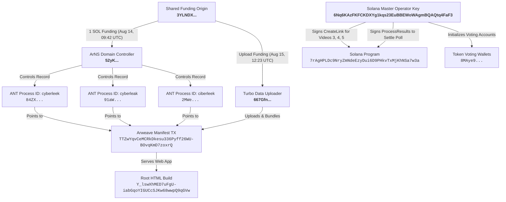
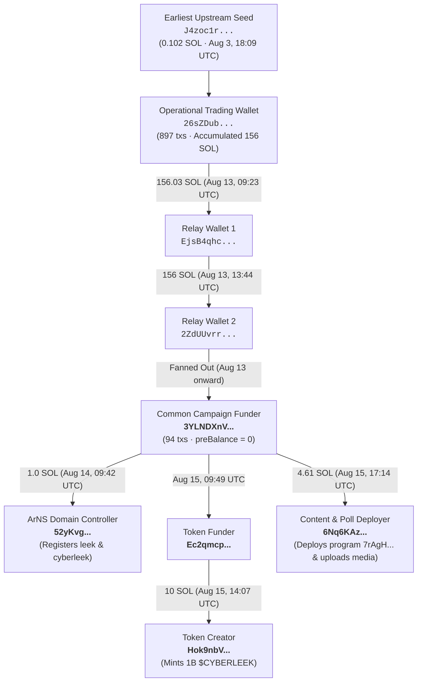
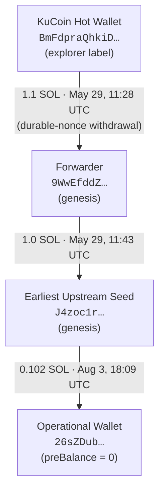

> [!NOTE]
> **Community Hub**: For extended discussions, deeper research materials, and community archives that cannot be hosted on GitHub, join our Discord server: https://discord.gg/jGrf68AH6n or Telegram: https://t.me/+6f_p37NsA2w2YWRk

# GTA 6 Leak Breakdown — The Cyberleek Files & Full Proof

 [](https://discord.gg/cF83SGS33m)

Everything we know about the August 2026 GTA VI gameplay leaks. Every claim backed with links, hashes, technical video checks, and on-chain proof.

💬 **Official Research Community Discord**: Join our community server created by the repo owner for leak research, evidence submission, and discussion: [**https://discord.gg/cF83SGS33m**](https://discord.gg/cF83SGS33m)

> [!CAUTION]
> <a id="key-alerts"></a>
> ### ⚠️ WARNING: DO NOT TRUST TWITTER/X OR DISCORD PRETENDER ACCOUNTS
> 
> **Please read this before reviewing any claims or evidence in this repository:**
> 
> * ❌ **THE ORIGINAL CYBERLEEK HAS NO TWITTER / X**: In the official 4th video drop (`junkies.mp4`), the original creator of the CyberLeek website placed a permanent watermark directly on the video:  
>   > **`"CYBERLEEK DOES NOT HAVE TWITTER — OFFICIAL NEWS ONLY HERE"`**  
>   Because of this explicit confirmation, **Twitter/X accounts claiming to be the original CyberLeek (such as suspended `@cyberleek_ar_io`, backup `@MrCyberLeek`, `@cyberleekario`, etc.) must NOT be treated as the original creator unless there is strong proof showing otherwise**. They are unverified imposter accounts looking for attention.
> * 💬 **DISCORD PRETENDER ACCOUNTS ARE UNVERIFIED**: Accounts on Discord using names like `cyberleek`, `cyberleek_west`, or `surwest`, along with servers claiming inside leaks, are pretenders. Their storyline claims (Lucia intro mission, 2% prison pickup, robux-style currencies) have **zero proof in the leaked game files**.
> * 🛡️ **SEPARATING REAL COMMUNITY RESEARCH FROM FAKE PRETENDER CLAIMS**:
>   * 🟢 **GENUINE INDEPENDENT COMMUNITY RESEARCH**: Independent analysis done by community members (such as NateDrake confirming build age, NikTek analyzing physics/mechanics, Phantomymous finding the Tate McRae song, 7Kkurd identifying the in-car CarPlay logo, martipk and the mapping project, theicybee mapping routes, and koffiekasper checking smart contract bytecode) is **real third-party research**. These community contributors are NOT scammers and their legitimate findings remain credited and untouched.
>   * 🔴 **FAKE / UNVERIFIED PRETENDER CLAIMS**: Story spoilers, fake threats, blurred recycled photos, and staged SWAT raids coming from Twitter/X and Discord pretenders are unverified or proven fake.
>   * 🎮 **ALL 5 GAMEPLAY VIDEOS & MAP ARE 100% GENUINE**: All 5 video files (`output.mp4`, `video2.mp4`, `taser.mp4`, `junkies.mp4`, and `plane.mp4`) and map files are real early Rockstar developer footage (actively taken down worldwide by Take-Two DMCA copyright notices).
>   * 🧱 **THE LEAKER MIGHT HAVE A PLAYABLE GAME BUILD (NOT 100% CONFIRMED)**: In the newest 5th video (`plane.mp4`), Jason [literally shoots the word "LEEK" onto an alley wall with bullet holes](#full-build-theory). This proves the person recording was actively playing with live controller/mouse inputs in real time. However, **it is NOT 100% confirmed that they have the full game** — they might only have access to an internal test build or an insider recording for them.
>   * ✈️ **VIDEO 5 DROPPED (Plane DAY & Alley Shooting — VERIFIED)**: Released on **August 20, 2026 at 09:43:02 UTC** via Solana/Arweave transaction `2qfZLmTts5GdBpGSfEpwcKPfAgsVJyxPabKoqTwzoWyK8rCNQTi4apPbdKDxKuzgAxr58QnixksbDUTpTT3Zp9NH` (`plane.mp4`, 141.5s / 33.8 MB). Video 5 fulfills the website poll with clean 1080p HDR footage showing a flight over the Leonida Penitentiary, the Vice City marina and skyline, and Jason testing gun recoil by shooting "LEEK" on a wall.
>   * ⚠️ **OFFICIAL WEBSITE MEMECOIN WARNING**: The `$CYBERLEEK` Solana token and voting polls run on the leaker's website are high-risk memecoin mechanics / probable pump-and-dump scheme. **Do NOT buy their token or send crypto.**
>   * 🟢 **LIVE STATUS UPDATE**: ALL official websites, portals, and Web3 gateway mirrors ([**`*[Media removed to comply with policies. For extended research archives and community discussions, join our Discord: https://discord.gg/jGrf68AH6n or Telegram: https://t.me/+6f_p37NsA2w2YWRk]* [**`*[Media removed to comply with policies. For extended research archives and community discussions, join our Discord: https://discord.gg/jGrf68AH6n or Telegram: https://t.me/+6f_p37NsA2w2YWRk]* [**`*[Media removed to comply with policies. For extended research archives and community discussions, join our Discord: https://discord.gg/jGrf68AH6n or Telegram: https://t.me/+6f_p37NsA2w2YWRk]* [**`*[Media removed to comply with policies. For extended research archives and community discussions, join our Discord: https://discord.gg/jGrf68AH6n or Telegram: https://t.me/+6f_p37NsA2w2YWRk]* [**`*[Media removed to comply with policies. For extended research archives and community discussions, join our Discord: https://discord.gg/jGrf68AH6n or Telegram: https://t.me/+6f_p37NsA2w2YWRk]* are **100% ONLINE & ACTIVE (UP)**.
>   * 🇩🇪 **LEAKER IDENTITY**: 2018 German forum records on `szenebox.org` and German server hosting ([Hetzner Online in Nuremberg, Bavaria, Germany `49.13.45.141`](https://ipinfo.io/49.13.45.141)) point to the leaker likely being an adult German or Swiss speaker (around 33 to 38 years old), though their real world identity is unconfirmed.

<div align="center">

### 🚨 MAJOR DISCOVERY: LEAKER SHOOTS "LEEK" ON WALL WITH BULLET HOLES (POSSIBLE PLAYABLE BUILD)
*[Media removed to comply with policies. For extended research archives and community discussions, join our Discord: https://discord.gg/jGrf68AH6n or Telegram: https://t.me/+6f_p37NsA2w2YWRk]*

*In the newest 5th video drop (`plane.mp4` at 01:37), Jason Duval aims an assault rifle and shoots the word **`L E E K`** directly into the alley wall with live bullet holes.*

</div>

> [!IMPORTANT]
> **🎮 DOES THE LEAKER HAVE A PLAYABLE GAME BUILD? (⚠️ NOT 100% CONFIRMED — UNVERIFIED)**
> * **Live Player Input Confirmed**: In Video 5 (`plane.mp4`), the player actively controls Jason to spell out **`L E E K`** on the wall with bullet holes. This proves the footage is **not an old pre-rendered trailer or static video** — someone was actively playing the game with live controller/mouse inputs.
> * **⚠️ NOT 100% CONFIRMED**: While live gameplay was recorded, **it is NOT 100% confirmed that the leaker possesses the full playable game build**. They might only have access to a small internal test slice, remote debug access, or an insider who recorded it for them.
> * 🔗 [Read the full Game Build Access Analysis in Section 8.9](#full-build-theory) | [View the Video 5 breakdown in Section 4.5](#plane-breakdown)

<div align="center">

#### ❌ Official Proof from Video 4 Watermark: "CYBERLEEK DOES NOT HAVE TWITTER"


*In the 4th video drop (`junkies.mp4`), the official watermark explicitly states: **`"CYBERLEEK DOES NOT HAVE TWITTER — OFFICIAL NEWS ONLY HERE"`**.*

</div>

> [!NOTE]
> **TIMING**: These leaks dropped between August 16 and August 20, 2026, leading up to the official "GTA VI: An Extended Look" Netflix premiere on **August 27, 2026 at 3:00 PM ET**. The game launches **November 19, 2026** on PS5 and Xbox Series X|S.

---

## 📑 Clickable Table of Contents / Jump to Section

> [!NOTE]
> ### 🧭 Table of Contents Color Guide:
> * ⚫ **Black Circle**: **Most Important / Top-Priority Findings** (Core Leaked Files, Video Breakdowns, Map, LEEK Bullet Proof, Master Operator Keys)
> * 🔵 **Blue Circle**: **High-Importance Verified Facts & Technical Details** (Direct Links, Video Specs, Master Timeline, Official Endpoints, Poll Results)
> * 🟢 **Green Circle**: **Verified Community Research & Real Analysis** (Community Mapping, Radio Song Age Proof, Media Coverage, Legal Notices)
> * 🟡 **Yellow Circle**: **Unverified Theories & Ongoing Research** (Game Build Access Scope, Open Questions)
> * ❌ **Red 'X' / Red Icon**: **Debunked Claims, Fake Theories & Imposter Accounts** (Twitter Pretenders, Staged SWAT Memes, RDR2 Mod Hoax)

---

* ⚫ **[Important Facts & Latest Status (Must Read First)](#key-alerts)**

* ⚫ **[1. What Got Leaked (All 8 Files — 5 Videos + 3 Maps)](#what-got-leaked)**
  * ⚫ [File 1: Basketball Gameplay Clip (`output.mp4`)](#bball-clip)
  * ⚫ [File 2: Highway Driving & Delivery Van Clip (`video2.mp4`)](#driving-clip)
  * ⚫ [File 3: Full State of Leonida Map (`full_map.png`)](#full-map)
  * 🔵 [File 4: Map Sneak Peek 1 (Dalton Island)](#dalton-island)
  * 🔵 [File 5: Map Sneak Peek 2 (Catalan Key & Gloriana Key)](#catalan-key)
  * ⚫ [File 6: Taser, Truck Hijacking & Boat Cutscene Clip (`taser.mp4`)](#taser-clip)
  * ⚫ [File 7: Junkies Encounter, Police Motorcycle & Zombix Clip (`junkies.mp4`)](#junkies-clip)
  * ⚫ [File 8: Plane Flyover & Alley Shooting Clip (`plane.mp4`)](#plane-clip)

* 🔵 **[2. Direct Links & Mirror Table](#direct-links)**

* 🔵 **[3. Video Comparison & Technical Details](#video-comparison)**
  * 🔵 [3.1. Comprehensive Video Specs & Quality Table](#video-specs-table)
  * 🔵 [3.2. Technical Metadata & Audio Forensic Checks](#video-tech-forensics)

* ⚫ **[4. Second-by-Second Video Breakdown](#video-breakdown)**
  * ⚫ [4.1. Video 1: Basketball Gameplay Breakdown (69s)](#bball-breakdown)
  * ⚫ [4.2. Video 2: Highway Driving Breakdown (68s)](#driving-breakdown)
  * ⚫ [4.3. Video 3: Taser, Truck Hijacking & Boat Cutscene (124.5s)](#taser-breakdown)
  * ⚫ [4.4. Video 4: Junkies Encounter, Canal Fight & Police Motorcycle (144.5s)](#junkies-breakdown)
  * ⚫ [4.5. Video 5: Plane Flyover & Alley Shooting Breakdown (141.5s)](#plane-breakdown)
  * 🔵 [4.6. New HUD & Gameplay Mechanics Discovered](#new-hud-mechanics)
    * 🔵 [1. Vehicle Theft: Clone Key vs Smash Window](#hud-clone-key)
    * 🔵 [2. Health & Focus / Stamina Meter](#hud-stamina-meter)
    * 🔵 [3. Modern Radar Minimap](#hud-minimap)
    * 🔵 [4. RDR2 Dialogue Tree (Greet / Taunt / Defuse / Warn)](#hud-rdr2-dialogue)
    * 🔵 [5. Police Danger Zone & Search Radius](#hud-wanted-radius)
    * 🔵 [6. Karma & Morality System](#hud-karma-morality)
    * 🔵 [7. Zombix Drug Tolerance & Consumables](#hud-zombix-system)
    * 🔵 [8. Fuzzard Drain Canal Basin](#hud-fuzzard-canal)
    * 🔵 [9. Vehicle Fuel & Gas Gauge](#hud-fuel-gauge)
    * 🔵 [10. In-Car iFruit CarPlay Navigation](#hud-carplay-nav)
  * 🟢 [4.7. Community Gameplay Observations on X (@NikTek)](#niktek-breakdown)

* ⚫ **[5. Map & County Breakdown](#map-breakdown)**
  * 🔵 [5.1. Map Zoom Road Networks & Geography](#map-zoom)
  * 🔵 [5.2. Map Size Comparison (1.656x Bigger than GTA V)](#landmass-size)
  * 🔵 [5.3. Legendary Animals Confirmed (RDR2 Hunting System)](#legendary-animals)
  * 🔵 [5.4. Deep Dive: Lummox County & Mount Kalaga](#lummox-county)
  * 🟢 [5.5. Verified Path in Video 4: South Vice-Dale & Route 97 (@theicybee)](#jason-junkies-path)

* 🔵 **[6. Complete Timeline & Date Proof](#timeline)**

* ❌ **[7. Claims Made on Discord (Archived Evidence — Unverified & Pretender Claims)](#discord-qa)**
  * ❌ [7.1. Lucia's Intro Mission (Unverified Speculation)](#qa-lucia-intro)
  * ❌ [7.2. Prison Pickup & 2% Campaign Progression (Unverified Speculation)](#qa-prison-pickup)
  * ❌ [7.3. Leaked Map from 2023 & PS5 Pro Performance (Unverified Claim)](#qa-map-ps5pro)
  * ❌ [7.4. "Cyberleek Did Not Record Footage" (Pretender Deflection)](#qa-leaker-recorded)
  * ❌ [7.5. Real-Money Creator Currency / Robux Theory (Proved Fake Crypto Bait)](#creator-currency-claim)
  * ❌ [7.6. Discord Server Bans, Replacement Servers & Fake Twitter Drama](#discord-bans)
  * ❌ [7.7. "GTA 6: Lucia Ending Video" Discord Teaser & Reddit Post (Unverified Mockup)](#qa-lucia-ending-mockup)
  * ❌ [7.8. The "808 Mafia / Clumsylulz" Telegram Fake](#clumsylulz-telegram-fake)

* 🔵 **[8. Web Research: Online Setup, Dark Web & Debunking](#web-research)**
  * ❌ [8.1. Online Accounts & Imposter Handles Breakdown](#official-accounts)
  * 🔵 [8.2. Official Endpoints & Live Status Tracker](#official-endpoints)
  * 🔵 [8.3. Server Infrastructure, IP Resolution & Hosting Providers](#server-hosting)
  * 🔵 [8.4. Blockchain & Money Trail (Token & Website Set Up 3 Days Early)](#token-money-trail)
    * 🔵 [8.4.1. What Public Blockchain Data Confirms](#blockchain-facts)
    * 🟡 [8.4.2. Was the Leak a Pre-Planned Marketing Stunt?](#marketing-stunt-theory)
    * 🟡 [8.4.3. What We Still Don't Know & Counter-Points](#blockchain-counterpoints)
    * ❌ [8.4.4. Smart Contract Bytecode: Debunking "GTA Audio SDT" False Positives (@koffiekasper)](#solana-bytecode-analysis)
  * 🔵 [8.5. Hack Forums & The Dark Web Trail (Dread `CyberLeeker`)](#dread-trail)
    * 🔵 [8.5.1. The 'Three Commandments' Manifesto & Demands](#manifesto-three-commandments)
  * ❌ [8.6. Twitter/X Pretender Accounts & Fake Staged Drama (Full Breakdown)](#debunking-twitter)
    * ❌ [8.6.1. Deceptive Username History & Renamed Accounts](#debunking-username-history)
    * ❌ [8.6.2. Fake AI-Generated Banners & Recycled Teasers](#debunking-ai-banners)
    * ❌ [8.6.3. Proved Fake Threat: Blurred 2022 Leaks as "New Footage"](#debunking-blurred-threats)
    * ❌ [8.6.4. The Outside Imposter / Middleman Reality](#debunking-middleman-reality)
    * ❌ [8.6.5. Official Proof: "CYBERLEEK DOES NOT HAVE TWITTER"](#debunking-watermark-proof)
    * ❌ [8.6.6. Proved Fake Drama: Account Suspension & Staged "FBI Raid" Meme GIF](#debunking-fbi-raid-larp)
    * ❌ [8.6.7. Deep Investigation: @cyberleek_of Imposter Account & Recycled Media Breakdown](#debunking-cyberleek-of)
    * ❌ [8.6.8. How DexScreener Linked @cyberleek_ar_io Before Account Suspension](#debunking-dexscreener-twitter)
  * 🔵 [8.7. Video 5 Release & Website Poll: "Plane (DAY)" (Delivered via On-Chain Drop)](#poll-plane-winner)
    * 🔵 [8.7.1. Poll Countdown & Release Window (Aug 20, 11:26 UTC)](#poll-countdown-timer)
    * 🔵 [8.7.2. The $80.24 Vote Transfer (65,342 $CYBERLEEK)](#poll-whale-tx)
    * 🔵 [8.7.3. What the Ballots Reveal (Organized Playtest Vault)](#poll-vault-categories)
    * ❌ [8.7.4. Scam Warning on Voting Token Sinks](#poll-token-sink)
    * 🔵 [8.7.5. Technical Breakdown: Centralized Poll Architecture & Upgrade Authority](#poll-centralized-architecture)
  * 🟢 [8.8. Hard Proof on Footage Age (Tate McRae Song & NateDrake)](#natedrake-age)
  * ⚫ [8.9. Game Build Access Analysis: Active Playable Access Confirmed via "LEEK" Bullet Wall Test](#full-build-theory)
  * ❌ [8.10. 100% Debunked Fake Theory: "RDR2 Mod with Cities: Skylines Map"](#debunking-rdr2-mod)
  * 🟢 [8.11. Deep Dive: German & Swiss Identity Profile (SzeneBox & tech-forum.ch)](#szenebox-profile)
    * 🟢 [8.11.1. The 2018 Forum Posts & German Slang](#szenebox-2018-posts)
    * 🟢 [8.11.2. The Second Account (`tech-forum`), Swiss Site (`tech-forum.ch`), Wayback & WHOIS](#szenebox-techforum-account)
    * 🟢 [8.11.3. 2023 Forum Activity (Data Leaks, BreachForums & VPNs)](#szenebox-2023-activity)
    * 🟢 [8.11.4. Age, Server Infrastructure & Summary Profile](#szenebox-identity-summary)
  * ⚫ [8.12. On-Chain Control Architecture: ArNS Domains, Funding Wallets & Solana Master Operator Key](#onchain-control-architecture)
    * ⚫ [8.12.1. ArNS Name Network (`cyberleek`, `cyberleak`, `ciberleek`)](#arns-domain-network)
    * ⚫ [8.12.2. The 3-Tier Arweave Wallet Pipeline (`3YLNDX...` / `52yK...` / `667Gfn...`)](#arweave-wallet-pipeline)
    * ⚫ [8.12.3. Solana Master Operator Key (`6Nq6...`) & Program Control](#solana-master-operator)
    * ⚫ [8.12.4. Complete Upstream Wallet Cluster & Funding Chain](#upstream-wallet-cluster)

* 🟢 **[9. How Everyone Reacted (Industry, Communities & Legal Responses)](#reactions)**
  * 🛑 [9.1. Stop Killing Games (Ross Scott) Official Disassociation](#reaction-skg)
  * 🟢 [9.2. Reddit & Gaming Community Consensus](#reaction-reddit)
  * 📰 [9.3. Major Gaming Press & Media Coverage](#reaction-press)
  * ⚖️ [9.4. Take-Two Interactive & Rockstar Legal Enforcement](#reaction-take-two)

* 🟡 **[10. What We Still Don't Know](#unknowns)**

* ⚖️ **[11. Final Verdict](#verdict)**

* 📜 **[12. Legal Disclaimer & Fair Use Notice](#legal-disclaimer)**
  * ⚖️ [12.1. Fair Use Statement (17 U.S.C. § 107)](#fair-use-statement)
  * 🚫 [12.2. No-Hosting Policy & Zero Binary Rule](#no-hosting-policy)
  * 📩 [12.3. DMCA Takedown & Copyright Notice Protocol](#dmca-protocol)

* 🤝 **[13. Contributing & Submitting Evidence](#contributing)**

* ☕ **[14. Support the Research & Tip Addresses](#support-research)**

---

<a id="what-got-leaked"></a>
## 1. What Got Leaked (All 8 Files — 5 Videos + 3 Maps)

Here are the 8 files leaked by Cyberleek between August 16 and August 20, 2026 (5 gameplay videos totaling ~9 minutes 7 seconds of footage, plus 3 map files):

<a id="bball-clip"></a>
### File 1: Basketball Gameplay Clip
*[Media removed to comply with policies. For extended research archives and community discussions, join our Discord: https://discord.gg/jGrf68AH6n or Telegram: https://t.me/+6f_p37NsA2w2YWRk]*
*Jason shooting hoops at a waterfront house in Leonida, showing the "Focus" bar.*

* **ID**: `MEDIA-01-BBALL`
* **What you see**: Jason shooting hoops on a wooden deck at a waterfront house somewhere in Leonida. There's a "Focus" meter that fills up when you make shots — looks like a proper gameplay mechanic, not a debug thing.
* **Found at**: `*[Media removed to comply with policies. For extended research archives and community discussions, join our Discord: https://discord.gg/jGrf68AH6n or Telegram: https://t.me/+6f_p37NsA2w2YWRk]* (pulled from Solana account `FSKYZHqqzwKMYevwdZuAM4KRkcNQZqto9RLM27nKeEas`)
* **Direct download**: [`arweave.net/3XQv_9nd...`](*[Media removed to comply with policies. For extended research archives and community discussions, join our Discord: https://discord.gg/jGrf68AH6n or Telegram: https://t.me/+6f_p37NsA2w2YWRk]*
* **Backup mirror**: [`upload.ee/files/19658673`](*[Media removed to comply with policies. For extended research archives and community discussions, join our Discord: https://discord.gg/jGrf68AH6n or Telegram: https://t.me/+6f_p37NsA2w2YWRk]*
* **Filename**: `output.mp4`
* **Size**: 34.19 MB (35,845,958 bytes)
* **Resolution**: 2560×1440 (1440p QHD)
* **FPS**: 30.00 (constant)
* **Length**: 69 seconds (01:09)
* **Video format**: H.265/HEVC, 10-bit color, BT.2020 (Main 10)
* **Audio**: AAC stereo, 48kHz, ~162 kbps
* **SHA-256**: `bbcb8f662b694fc894f09d57a92c4e3cae6df5b9e078ecba6cb6002f23cf9e90`
* **MD5**: `fae109d94943fcfcbffc58a8a4789528`
* **Blockchain proof**: [Arweave Block #1982091](*[Media removed to comply with policies. For extended research archives and community discussions, join our Discord: https://discord.gg/jGrf68AH6n or Telegram: https://t.me/+6f_p37NsA2w2YWRk]* — uploaded Aug 17, 2026 at 21:07 UTC

---

<a id="driving-clip"></a>
### File 2: Highway Driving & Delivery Van Clip
*[Media removed to comply with policies. For extended research archives and community discussions, join our Discord: https://discord.gg/jGrf68AH6n or Telegram: https://t.me/+6f_p37NsA2w2YWRk]*
*Jason driving a Declasse Picador along coastal highways passing overhead signs for Goose Key and Vice City.*

* **ID**: `MEDIA-02-DRIVE`
* **What you see**: Jason driving a Declasse Picador pickup down a highway. You can see overhead green highway signs for **Goose Key**, **Hamlet**, and **Vice City**, plus other traffic like delivery vans and pickup trucks.
* **Found at**: `*[Media removed to comply with policies. For extended research archives and community discussions, join our Discord: https://discord.gg/jGrf68AH6n or Telegram: https://t.me/+6f_p37NsA2w2YWRk]* (Solana account `9pUqCNKgRctNcm8F6gr6kYZkP5stzGzVRCAX1qcpVXoE`)
* **Direct download**: [`arweave.net/hhOoYZt...`](*[Media removed to comply with policies. For extended research archives and community discussions, join our Discord: https://discord.gg/jGrf68AH6n or Telegram: https://t.me/+6f_p37NsA2w2YWRk]*
* **Backup mirrors**: [`transfiles.ru/ybyf9`](*[Media removed to comply with policies. For extended research archives and community discussions, join our Discord: https://discord.gg/jGrf68AH6n or Telegram: https://t.me/+6f_p37NsA2w2YWRk]* / [`upload.ee/files/19662951`](*[Media removed to comply with policies. For extended research archives and community discussions, join our Discord: https://discord.gg/jGrf68AH6n or Telegram: https://t.me/+6f_p37NsA2w2YWRk]*
* **Filename**: `video2.mp4`
* **Size**: 35.00 MB (36,700,160 bytes)
* **Resolution**: 1920×1080 (1080p Full HD)
* **FPS**: 30.00 (constant)
* **Length**: 68 seconds (01:08)
* **Video format**: H.265/HEVC, 10-bit color, BT.2020 (Main 10)
* **Audio**: AAC stereo, 48kHz, ~162 kbps
* **SHA-256**: `c2a2284d8bb5be8d022b7d41f021703666d40026e632b7937faeb5ef4c49d6ae`
* **MD5**: `2e5bbfe76c5b9671d4715694a974b8fb`
* **Blockchain proof**: [Arweave Block #1982709](*[Media removed to comply with policies. For extended research archives and community discussions, join our Discord: https://discord.gg/jGrf68AH6n or Telegram: https://t.me/+6f_p37NsA2w2YWRk]* — uploaded Aug 18, 2026 at 19:05 UTC

---

<a id="full-map"></a>
### File 3: Full State of Leonida Map
* **ID**: `MEDIA-03-MAPFULL`
* **What you see**: The entire state of Leonida with 5 counties labeled — Lummox, Kelly, Leonard, Vice-Dale, and Mariana. Vice City is in the southeast corner.
* **Found at**: `*[Media removed to comply with policies. For extended research archives and community discussions, join our Discord: https://discord.gg/jGrf68AH6n or Telegram: https://t.me/+6f_p37NsA2w2YWRk]* (Solana account `GwrASq3dqB5e1M2pti8bWiLNJZZhnsxHtsYpu7Y1bWcU`)
* **Direct download**: [`arweave.net/GVTWJUb...`](*[Media removed to comply with policies. For extended research archives and community discussions, join our Discord: https://discord.gg/jGrf68AH6n or Telegram: https://t.me/+6f_p37NsA2w2YWRk]*
* **Backup**: [`upload.ee/files/19662855`](*[Media removed to comply with policies. For extended research archives and community discussions, join our Discord: https://discord.gg/jGrf68AH6n or Telegram: https://t.me/+6f_p37NsA2w2YWRk]*
* **Filename**: `full_map.png`
* **Size**: 3.54 MB
* **Dimensions**: 2590×3240
* **Color**: 32-bit RGBA
* **SHA-256**: `c5a07256f62f3ae37904540621f2b07d2f647fd10867b620622b3471910563f6`
* **MD5**: `23a7aee2466b437d3de34a6fc0f44657`
* **Note**: Has blue border banners added by Cyberleek pushing their branding. The map itself underneath looks real. Cyberleek claimed in Discord that **this map is from 2023** (see Discord Claims section below).

---

<a id="dalton-island"></a>
### File 4: Map Sneak Peek 1 (Dalton Island)
* **ID**: `MEDIA-04-MAPPEEK1`
* **What you see**: A zoomed-in crop of Dalton Island (GTA's version of Fisher Island, Miami).
* **Direct download**: [`arweave.net/MyMFWWJ...`](*[Media removed to comply with policies. For extended research archives and community discussions, join our Discord: https://discord.gg/jGrf68AH6n or Telegram: https://t.me/+6f_p37NsA2w2YWRk]*
* **Filename**: `map_sneak_peek_1.png`
* **Size**: ~768 KB (1110×880)
* **SHA-256**: `0d1f9f522b7cd5ac4e4b9702a73e1b7aaac86b3cbd4befb725c488fa4ff9bb12`
* **MD5**: `963f64f3361f3f429b494081957b7878`

---

<a id="catalan-key"></a>
### File 5: Map Sneak Peek 2 (Catalan Key & Gloriana Key)
* **ID**: `MEDIA-05-MAPPEEK2`
* **What you see**: Zoomed-in crop showing Catalan Key, Gloriana Key, Tequesta Retreat, and Catalan Bay.
* **Direct download**: [`arweave.net/zbfExgT...`](*[Media removed to comply with policies. For extended research archives and community discussions, join our Discord: https://discord.gg/jGrf68AH6n or Telegram: https://t.me/+6f_p37NsA2w2YWRk]*
* **Filename**: `map_sneak_peek_2.png`
* **Size**: ~900 KB (1140×907)
* **SHA-256**: `b223c52138bc03a6fc4f27ab0dd58f95cf7ae173efb948a452ea7bf5b552cbac`
* **MD5**: `4b5f4272c6e96cae827204cd7634437d`
* **Blockchain proof**: [Arweave Block #1981170](*[Media removed to comply with policies. For extended research archives and community discussions, join our Discord: https://discord.gg/jGrf68AH6n or Telegram: https://t.me/+6f_p37NsA2w2YWRk]* — uploaded Aug 16, 2026 at 13:04 UTC

---

<a id="taser-clip"></a>
### File 6: Taser, Truck Hijacking & Boat Cutscene Clip
*[Media removed to comply with policies. For extended research archives and community discussions, join our Discord: https://discord.gg/jGrf68AH6n or Telegram: https://t.me/+6f_p37NsA2w2YWRk]*
*Jason aiming the Stun Gun / Taser (`9 1` ammo) inside the Allied Crystal Co. warehouse yard.*

*[Media removed to comply with policies. For extended research archives and community discussions, join our Discord: https://discord.gg/jGrf68AH6n or Telegram: https://t.me/+6f_p37NsA2w2YWRk]*
*Daytime story scene on a boat in the mangrove keys.*

* **ID**: `MEDIA-06-TASER`
* **What you see**: 
  * **Part 1 (0:00 – 1:52.5)**: Jason drives a muscle car into the **Allied Crystal Co.** sugar refinery yard at night in Ambrosia, turns on his gun flashlight, equips a **Stun Gun / Taser** (`9 1` ammo), tasers a worker, and steals an **MTL Packer** big rig while the worker yells: *"Stop! That's a gift from one of my boyfriends!"*
  * **Cut (1:52.5 – 1:54.5)**: 2-second black screen with no sound where two clips were edited together.
  * **Part 2 (1:54.5 – 2:04.5)**: A daylight scene on a boat in the swamp. Jason drinks beer with a friend with real voice acting: *"Good living. Here's to you, buddy."* → *"Enjoy your life till the men in suits decide to finally shut you the fuck up."*
* **Mirrors**: [`gofile.io/d/qW134pdk`](*[Media removed to comply with policies. For extended research archives and community discussions, join our Discord: https://discord.gg/jGrf68AH6n or Telegram: https://t.me/+6f_p37NsA2w2YWRk]* / [`bedrive.ru/ead5`](*[Media removed to comply with policies. For extended research archives and community discussions, join our Discord: https://discord.gg/jGrf68AH6n or Telegram: https://t.me/+6f_p37NsA2w2YWRk]*
* **Filename**: `taser.mp4`
* **Size**: 28.21 MB (28,213,903 bytes)
* **Resolution**: 1920×1080 (1080p Full HD)
* **FPS**: 30.00 (constant)
* **Length**: ~124.5 seconds (2 minutes, 4.5 seconds)
* **Video format**: H.265/HEVC, 10-bit color, BT.2020 (Main 10)
* **Audio**: AAC stereo, 48kHz, 160 kbps CBR
* **SHA-256**: `785697aa8ae852aed899588ccf7d705b43addbc50e5ac690c7df9a1c60972287`
* **SHA-1**: `5d51153818628d52bbc86c7887fb2cf9a73f83f2`
* **MD5**: `92c97b54211d6d08cceda9ac62a10ef6`
* **Software used to edit**: FFmpeg 6.1 (`Lavf60.16.100` / `Lavc60.31.102 libx265`) — **exact same setup used on the Basketball and Driving videos**.

---

<a id="junkies-clip"></a>
### File 7: Junkies Encounter, Police Motorcycle & Zombix Clip
*[Media removed to comply with policies. For extended research archives and community discussions, join our Discord: https://discord.gg/jGrf68AH6n or Telegram: https://t.me/+6f_p37NsA2w2YWRk]*
*Jason knocking down a Vice City Police Department motorcycle officer at the intersection.*

*[Media removed to comply with policies. For extended research archives and community discussions, join our Discord: https://discord.gg/jGrf68AH6n or Telegram: https://t.me/+6f_p37NsA2w2YWRk]*
*Fuzzard Drain Canal underneath massive highway overpasses.*

*[Media removed to comply with policies. For extended research archives and community discussions, join our Discord: https://discord.gg/jGrf68AH6n or Telegram: https://t.me/+6f_p37NsA2w2YWRk]*
*Homeless camp brawl, RDR2 Stranger interaction prompts, and Zombix medical consumable discovery.*

* **ID**: `MEDIA-07-JUNKIES`
* **What you see**:
  * **Part 1 (0:00 – 0:18)**: Jason (wearing a red/brown t-shirt, jeans, and a watch) walks across a highway median marked with an overhead **"TO 97"** route shield sign. A **Vice City Police Department motorcycle officer** is knocked down next to his fallen motorcycle ("VICE CITY POLICE" on the fairing). Jason fights the officer with hand-to-hand combat.
  * **Part 2 (0:18 – 0:36)**: Jason steals the police motorcycle and accelerates down a multi-lane highway past a **Vapid** dealership sign.
  * **Part 3 (0:36 – 0:50)**: Jason rides into the **Fuzzard Drain Canal** beneath massive highway overpass pillars with realistic water reflections. A 1-Star wanted level triggers with disguise/glove icons.
  * **Part 4 (0:50 – 1:35)**: Jason walks into a detailed homeless encampment with tents, shopping carts, and junked cars. The **Red Dead Redemption 2 interaction dialogue wheel** appears on screen (`GREET`, `TAUNT`, `STRANGER`). An NPC speaks: *"Guys, this is a crazy conversation."* A melee fight breaks out with a homeless man in a yellow shirt while a woman yells: *"Dude, stop!"*
  * **Part 5 (1:35 – 2:11.5)**: A gameplay tutorial box appears: *"Repeated use of Zombix will temporarily have a weaker effect on your health."* Jason equips a Hunting Knife and knife-fights hostile NPCs on the canal bank. A purple demon karma icon appears on the right screen edge.
  * **Cut (2:11.5 – 2:13.5)**: 2.04-second black screen with complete audio silence where two clips were edited together.
  * **Part 6 (2:13.5 – 2:24.5)**: Spliced daylight boat cutscene where Jason drinks beer with Raul: *"Enjoy your life till the moment I decide to finally shut you the fuck up."*
* **On-Chain Post**: Account `2XRc2NJhXkcFNBzWeMkbGunBMLLKRjdEkV9aBWZQ1ow`, Authority `6Nq6KAzFKFCKDXYg1kqs23EuBBEWoWAgmBQAQtq4FaF3`
* **On-Chain Transaction**: `3iKf4UjNdiCPR9K6PX8Y2WgP1cPB7QRwzBcC1g7HpKw8ruNGrRqzGeEhdN6PgijMVLk8XSMhpMYajMrv1MGe7cLv` (BlockTime `1787158475` / `2026-08-19 16:54:35 UTC`)
* **Main Mirror**: [`gofile.io/d/t87ORtpm`](*[Media removed to comply with policies. For extended research archives and community discussions, join our Discord: https://discord.gg/jGrf68AH6n or Telegram: https://t.me/+6f_p37NsA2w2YWRk]*
* **Filename**: `junkies.mp4`
* **Size**: 38.08 MB (39,933,164 bytes)
* **Resolution**: 1920×1080 (1080p Full HD)
* **FPS**: 30.00 (constant)
* **Length**: ~144.53 seconds (2 minutes, 24.53 seconds)
* **Video format**: H.265/HEVC, 10-bit color, BT.2020 (Main 10)
* **Audio**: AAC stereo, 48kHz, 160.9 kbps CBR
* **SHA-256**: `44927e1820ee191df93666fb4d8add3fad7990d39ed3c4cabee60027ed0fc6d2`
* **SHA-1**: `c7124956ea8e474f92b31188ec0c311a9a341bcb`
* **MD5**: `6abf17ae32673056c8d34d7b3e15baa1`
* **Software used to edit**: FFmpeg 6.1 (`Lavf60.16.100` / `Lavc60.31.102 libx265`) — **exact same toolchain used across all leaked gameplay videos**.

---

<a id="plane-clip"></a>
### ✈️ File 8: Plane Flyover & Alley Shooting Clip (`plane.mp4`)
<div align="center">
*[Media removed to comply with policies. For extended research archives and community discussions, join our Discord: https://discord.gg/jGrf68AH6n or Telegram: https://t.me/+6f_p37NsA2w2YWRk]*
*[Media removed to comply with policies. For extended research archives and community discussions, join our Discord: https://discord.gg/jGrf68AH6n or Telegram: https://t.me/+6f_p37NsA2w2YWRk]*
</div>

*Left: High-altitude cinematic flyover passing directly above the Leonida State Penitentiary. Right: Groundbreaking interactive proof: Jason shoots the word "LEEK" on an alley wall with bullet holes.*

* **Official Poll Title**: *"Next GTA 6 Video... Cinematic drive by?"* / `Plane (DAY)`
* **File Name**: `plane.mp4`
* **File Size**: `35,446,922 bytes` (33.80 MB)
* **Duration**: **141.53 Seconds** (02:21.53 / 4,246 Frames at 30.00 FPS)
* **Resolution & Format**: `1920x1080` (1080p Full HD, 16:9), HEVC/H.265 (Main 10 Profile, BT.2020 HDR10), AAC Stereo (48,000 Hz)
* **Hashes**:
  * MD5: `9b4bcfec48f2de62cd4ff8989af65662`
  * SHA-1: `8dff04fe2e2c9987f343b821f4f50d576f931274`
  * SHA-256: `583226eb1635c611634e453146828caeaf9fa4c5abb25b21336ad5cfaa613037`
* **On-Chain Release Details**:
  * Transaction: `2qfZLmTts5GdBpGSfEpwcKPfAgsVJyxPabKoqTwzoWyK8rCNQTi4apPbdKDxKuzgAxr58QnixksbDUTpTT3Zp9NH`
  * Account: `2q3rEUUZ7ChHTLMx4QBAnew4q7UqaXXcqZ6NVgb7LZ6T`
  * Authority: `6Nq6KAzFKFCKDXYg1kqs23EuBBEWoWAgmBQAQtq4FaF3`
  * Release Timestamp: `2026-08-20 09:43:02 UTC` (`1787218982`)
  * Direct Mirror: [upload.ee Mirror](*[Media removed to comply with policies. For extended research archives and community discussions, join our Discord: https://discord.gg/jGrf68AH6n or Telegram: https://t.me/+6f_p37NsA2w2YWRk]*
* **Gameplay Highlights**:
  * Aerial flyover of the **Leonida State Penitentiary** (Lucia's prison from Trailer 1)
  * Panoramic flyover of Vice City skyline, yacht marinas, and domed sports arena
  * Dual-sequence structure: Flight test (0:00–1:09.5) followed by Jason alley wall shooting & wanted system test (1:11.5–1:41.5)
  * Full weapon ballistics, wall penetration chipping, and dynamic muzzle flash lighting

---

<a id="direct-links"></a>
## 2. Direct Links & Mirror Table

All external links and mirrors saved for checking:

| Item | Main Link | Backup Mirror | Quality & Format |
| :--- | :--- | :--- | :--- |
| **Basketball Video** | [Arweave Gateway](*[Media removed to comply with policies. For extended research archives and community discussions, join our Discord: https://discord.gg/jGrf68AH6n or Telegram: https://t.me/+6f_p37NsA2w2YWRk]* | [Upload.ee](*[Media removed to comply with policies. For extended research archives and community discussions, join our Discord: https://discord.gg/jGrf68AH6n or Telegram: https://t.me/+6f_p37NsA2w2YWRk]* | 1440p MP4 (34 MB) |
| **Driving Video** | [Arweave Gateway](*[Media removed to comply with policies. For extended research archives and community discussions, join our Discord: https://discord.gg/jGrf68AH6n or Telegram: https://t.me/+6f_p37NsA2w2YWRk]* | [Transfiles](*[Media removed to comply with policies. For extended research archives and community discussions, join our Discord: https://discord.gg/jGrf68AH6n or Telegram: https://t.me/+6f_p37NsA2w2YWRk]* / [Upload.ee](*[Media removed to comply with policies. For extended research archives and community discussions, join our Discord: https://discord.gg/jGrf68AH6n or Telegram: https://t.me/+6f_p37NsA2w2YWRk]* | 1080p MP4 (35 MB) |
| **Taser / Boat Video** | [Gofile.io](*[Media removed to comply with policies. For extended research archives and community discussions, join our Discord: https://discord.gg/jGrf68AH6n or Telegram: https://t.me/+6f_p37NsA2w2YWRk]* | [Bedrive.ru](*[Media removed to comply with policies. For extended research archives and community discussions, join our Discord: https://discord.gg/jGrf68AH6n or Telegram: https://t.me/+6f_p37NsA2w2YWRk]* | 1080p MP4 (28 MB) |
| **Junkies / Canal Video** | [Gofile.io](*[Media removed to comply with policies. For extended research archives and community discussions, join our Discord: https://discord.gg/jGrf68AH6n or Telegram: https://t.me/+6f_p37NsA2w2YWRk]* | Solana Tx `3iKf4UjN...` | 1080p MP4 (38 MB) |
| **Full Map** | [Arweave Gateway](*[Media removed to comply with policies. For extended research archives and community discussions, join our Discord: https://discord.gg/jGrf68AH6n or Telegram: https://t.me/+6f_p37NsA2w2YWRk]* | [Upload.ee](*[Media removed to comply with policies. For extended research archives and community discussions, join our Discord: https://discord.gg/jGrf68AH6n or Telegram: https://t.me/+6f_p37NsA2w2YWRk]* | 2590×3240 PNG (3.5 MB) |
| **Map Peek 1** | [Arweave Gateway](*[Media removed to comply with policies. For extended research archives and community discussions, join our Discord: https://discord.gg/jGrf68AH6n or Telegram: https://t.me/+6f_p37NsA2w2YWRk]* | — | 1110×880 PNG |
| **Map Peek 2** | [Arweave Gateway](*[Media removed to comply with policies. For extended research archives and community discussions, join our Discord: https://discord.gg/jGrf68AH6n or Telegram: https://t.me/+6f_p37NsA2w2YWRk]* | — | 1140×907 PNG |

---

<a id="video-comparison"></a>
## 3. Video Comparison & Technical Details

<a id="video-specs-table"></a>
### Comparing All 5 Videos:

| Video | Shared Footage | New Footage | Reused Footage | Main Highlights |
| :--- | :--- | :--- | :--- | :--- |
| **`output.mp4` (Basketball)** | None | **100% (69.0s)** | None | 1440p resolution; shows basketball minigame and Focus bar on a waterfront court. |
| **`video2.mp4` (Highway Drive)** | None | **100% (68.0s)** | None | 1080p resolution; shows Declasse Picador driving and highway signs to Goose Key & Hamlet. |
| **`taser.mp4` (Taser / Truck / Boat)** | None | **100% (124.5s)** | None | 1080p resolution; **2 clips joined together** showing night sugar refinery yard and day boat cutscene. |
| **`junkies.mp4` (Junkies / Canal / Boat)**| Boat cutscene (11s) | **92.4% (133.5s)**| Boat scene shared with `taser.mp4` | 1080p resolution; **2 clips joined together** showing police motorcycle combat, Fuzzard Drain Canal, homeless camp, Zombix health tip, and knife fight. |
| **`plane.mp4` (Plane / Alley Shooting)** | None | **100% (141.5s)** | None | 1080p HDR resolution; **2 clips joined together** showing stunt biplane flyover of Leonida Penitentiary, Vice City marina/skyline, and Jason shooting the word "LEEK" onto an alley wall. |

<a id="video-tech-forensics"></a>
### Technical Details Check:

| Check | `output.mp4` (Basketball) | `video2.mp4` (Highway) | `taser.mp4` (Taser / Boat) | `junkies.mp4` (Junkies / Canal) | What This Means |
| :--- | :--- | :--- | :--- | :--- | :--- |
| **Video Engine** | `Lavc60.31.102 libx265` | `Lavc60.31.102 libx265` | `Lavc60.31.102 libx265` | `Lavc60.31.102 libx265` | **Exact same video encoder** |
| **Software Toolchain** | FFmpeg 6.1 (`Lavf60.16.100`) | FFmpeg 6.1 (`Lavf60.16.100`) | FFmpeg 6.1 (`Lavf60.16.100`) | FFmpeg 6.1 (`Lavf60.16.100`) | Standard FFmpeg 6.1 build pairing |
| **Container Format** | QuickTime / MP4 (`isom/mp41`) | QuickTime / MP4 (`isom/mp41`) | QuickTime / MP4 (`isom/mp41`) | QuickTime / MP4 (`isom/mp41`) | Standard ISO MP4 container |
| **Color Depth** | `yuv420p10le` (10-bit) | `yuv420p10le` (10-bit) | `yuv420p10le` (10-bit) | `yuv420p10le` (10-bit) | High color quality from dev kit |
| **Color Standard** | `bt2020nc` | `bt2020nc` | `bt2020nc` | `bt2020nc` | Modern HDR standard |
| **Color Transfer** | SMPTE ST 2084 (PQ HDR10) | SMPTE ST 2084 (PQ HDR10) | SMPTE ST 2084 (PQ HDR10) | SMPTE ST 2084 (PQ HDR10) | HDR10 PQ transfer curve |
| **Frame Rate** | Smooth 30.00 fps | Smooth 30.00 fps | Smooth 30.00 fps | Smooth 30.00 fps (4,336 frames) | Standard console capture |
| **Sound Rate** | 48,000 Hz Stereo | 48,000 Hz Stereo | 48,000 Hz Stereo | 48,000 Hz Stereo (160.9 kbps) | Clear studio sound |
| **Character Outfit**| White tank top, cap | White tank top, cap | White tank top, cap | Red/brown t-shirt, watch | Different outfits / session saves |

> **Key takeaway**: The exact same software tags across all 5 videos prove that the same person/setup converted, watermarked, and saved all of them. Notice that `taser.mp4`, `junkies.mp4`, and `plane.mp4` all feature the exact same 2-second black silence gap splicing different test scenes together!

---

<a id="video-breakdown"></a>
## 4. Second-by-Second Video Breakdown

Here is what happens across all 5 leaked gameplay videos, broken down second-by-second:

<a id="bball-breakdown"></a>
### Video 1: Basketball Gameplay (`output.mp4`, 69 Seconds)
*[Media removed to comply with policies. For extended research archives and community discussions, join our Discord: https://discord.gg/jGrf68AH6n or Telegram: https://t.me/+6f_p37NsA2w2YWRk]*

* **`00:00:00` — Outdoor Waterfront Court** — Jason stands on a clean wooden deck holding a basketball with ocean and modern house architecture in the background. *Why it matters*: Shows real-time sunlight, shadow angles, and water reflections.
* **`00:00:15` — Aiming the Basketball Shot** — Jason gets into shooting stance; a circular meter ("Focus" bar) appears around the player UI. *Why it matters*: First look at how mini-games and sports activities work in GTA VI.
* **`00:00:30` — First Shot & Focus Meter Charge** — Jason releases the ball; it swishes through the net, and the Focus meter gains a yellow charge segment. *Why it matters*: Confirms the Focus mechanic rewards player timing and accuracy with special gameplay buffs.
* **`00:00:48` — Dribble & Step-Back Shot** — Jason dribbles back to the three-point line and takes another shot. *Why it matters*: Shows smooth character body motion, natural foot stepping on wooden planks, and realistic net mesh physics.
* **`00:01:05` — Final Shot & Camera Reset** — Jason finishes shooting and turns around as the clip ends. *Why it matters*: Seamless camera movement returning back to normal free-roam mode.

---

<a id="driving-breakdown"></a>
### Video 2: Highway Driving & Delivery Van (`video2.mp4`, 68 Seconds)
*[Media removed to comply with policies. For extended research archives and community discussions, join our Discord: https://discord.gg/jGrf68AH6n or Telegram: https://t.me/+6f_p37NsA2w2YWRk]*

* **`00:00:00` — Driving the Declasse Picador** — Jason drives a rusty red/brown Declasse Picador pickup truck along a dual-lane asphalt highway. *Why it matters*: Shows real car handling, tire grip, and high-speed motion blur on Leonida roads.
* **`00:00:18` — Overhead Highway Exit Signs** — The car passes under large green overhead highway signs pointing toward **Goose Key**, **Hamlet**, and **Vice City**. *Why it matters*: Confirms real in-game travel routes connecting the Keys to the Vice City metro.
* **`00:00:35` — Traffic Density & Delivery Vans** — The truck passes commercial delivery vans and other traffic in the right lane. *Why it matters*: Shows working NPC traffic driving AI, lane-changing behavior, and varied vehicle models.
* **`00:00:52` — Suspension Bump over Bridge Joint** — The truck drives over a bridge road seam; the suspension bounces and shakes the camera naturally. *Why it matters*: Confirms realistic car suspension and shock-absorber physics.
* **`00:01:05` — Vice City Skyline Horizon** — Distant tall buildings of Vice City appear on the horizon across the water before the video ends. *Why it matters*: Confirms long-distance view distance across Leonida waterways.

---

<a id="taser-breakdown"></a>
### Video 3: Taser, Truck Hijacking & Boat Cutscene (`taser.mp4`, 124.5 Seconds)
*[Media removed to comply with policies. For extended research archives and community discussions, join our Discord: https://discord.gg/jGrf68AH6n or Telegram: https://t.me/+6f_p37NsA2w2YWRk]*

* **`00:00:00` — Night Driving in Muscle Car** — Jason drives a rusty muscle car on a dark road. *Why it matters*: Shows real car suspension bumps, headlight beams, and road wetness on the real game engine.
* **`00:00:23` — Pulling into Allied Crystal Yard** — Car turns into a factory gate with trucks and fuel tanks. *Why it matters*: Confirms the factory town of Ambrosia (parody of Clewiston, Florida).
* **`00:00:43` — Flashlight Button Tip** — Screen shows a hint: *"Tap [D-pad] while aiming to toggle your tactical flashlight."* *Why it matters*: Proves normal game button hints are working and guns have flashlight attachments.
* **`00:00:55` — Stun Gun / Taser Weapon** — Top-right screen shows `9 1` ammo with a yellow taser gun picture. *Why it matters*: First proof that GTA VI has a working non-lethal Stun Gun / Taser.
* **`00:01:13` — Shocking the Worker** — Jason shocks a factory worker who drops to the ground realistically. Ammo becomes `8 1`. *Why it matters*: Real body-ragdoll physics that can't be faked with simple game mods.
* **`00:01:29` — Funny Voice Line** — Jason runs toward a blue semi truck while the worker yells: *"Stop! That's a gift from one of my boyfriends!"* *Why it matters*: Real Rockstar humor and voice acting with zero past mentions anywhere online.
* **`00:01:47` — Stealing Semi Truck & In-Game Radio ("Sports Car" by Tate McRae)** — Jason gets in the truck; screen shows **`MTL PACKER`** and the vehicle radio plays *"Sports Car"* by Tate McRae. *Why it matters*: Tate McRae released this single on **January 24, 2025**, providing solid chronological proof that this GTA 6 build is from **early 2025 or newer**!
* **`00:01:52.5` — 2-Second Black Screen Cut** — Screen turns black with total silence for 2 seconds. *Why it matters*: Proves the leaker edited two separate videos together into one file.
* **`00:01:54.5` — Boat Story Scene** — Daytime cutscene on a boat where Jason and his friend cheers beer bottles with voice lines (*"Good living. Here's to you, buddy."* → *"Enjoy your life till the men in suits decide to finally shut you the fuck up."*). *Why it matters*: Real story cutscene showing skin detail, realistic eyes, and studio voice lines.

---

<a id="junkies-breakdown"></a>
### Video 4: Junkies Encounter, Canal Fight & Police Motorcycle (`junkies.mp4`, 144.5 Seconds)
*[Media removed to comply with policies. For extended research archives and community discussions, join our Discord: https://discord.gg/jGrf68AH6n or Telegram: https://t.me/+6f_p37NsA2w2YWRk]*
*Jason in hand-to-hand combat against a Vice City Police motorcycle officer.*

*[Media removed to comply with policies. For extended research archives and community discussions, join our Discord: https://discord.gg/jGrf68AH6n or Telegram: https://t.me/+6f_p37NsA2w2YWRk]*
*Homeless camp underneath the concrete highway overpasses.*

*[Media removed to comply with policies. For extended research archives and community discussions, join our Discord: https://discord.gg/jGrf68AH6n or Telegram: https://t.me/+6f_p37NsA2w2YWRk]*
*Knife combat on the embankment of Fuzzard Drain Canal.*

* **`00:00:00` — Golden Hour Intersection** — Jason (wearing a red/brown t-shirt, dark jeans, and a watch) walks across a highway median. An overhead cantilever arm displays a **"TO 97"** Florida route shield highway sign. *Why it matters*: Shows realistic dusk lighting, asphalt textures, and Leonida road numbering.
* **`00:00:08` — Police Motorcycle Officer Melee** — A Vice City Police Department motorcycle officer is down on the road next to a fallen police motorcycle with "VICE CITY POLICE" written on the windshield. Jason engages in fluid close-quarters hand-to-hand combat, knocking the officer unconscious. *Why it matters*: Confirms Vice City Police Department motorcycle units, realistic striking impact physics, and character combat animations.
* **`00:00:18` — Hijacking & Driving Police Bike** — Jason mounts the police motorcycle, starts the engine, and drives down the road past an overhead traffic signal and a **Vapid** dealership sign. *Why it matters*: Shows motorcycle acceleration physics, responsive turning, and brand-name vehicle dealerships.
* **`00:00:36` — Fuzzard Drain Canal** — Jason steers the motorcycle down into the concrete embankment of **Fuzzard Drain Canal** underneath massive elevated highway overpasses. A 1-Star wanted level triggers with disguise/glove icons. *Why it matters*: Reveals a brand-new, never-before-seen canal basin location in Vice City with realistic murky water reflections and concrete slope physics.
* **`00:00:50` — Detailed Homeless Encampment** — Jason walks into an active homeless tent city under the concrete pillars filled with tents, shopping carts, trash piles, and junked cars. *Why it matters*: Shows immense environmental detail and atmospheric world-building in Vice City's hidden corners.
* **`00:01:00` — RDR2 Stranger Interaction Menu** — When approaching the homeless NPCs, the **Red Dead Redemption 2 interaction dialogue prompt** appears in the lower-right (`GREET`, `TAUNT`, `STRANGER`). An NPC speaks: *"Guys, this is a crazy conversation."* *Why it matters*: 100% proves the Red Dead Redemption 2 dynamic conversation tree has been fully built into GTA VI.
* **`00:01:15` — Encampment Fist Fight** — A fight breaks out; Jason punches a homeless man in a yellow shirt. A woman in a blue tank top panics and yells: *"Dude, stop!"* The wanted level increases to 2 Stars. *Why it matters*: Shows dynamic civilian panic reactions, realistic facial expressions, and adaptive voice response lines.
* **`00:01:35` — Zombix Health Drug Mechanic** — A gameplay tutorial pop-up appears on the left: *"Repeated use of Zombix will temporarily have a weaker effect on your health."* Jason equips a Hunting Knife / Pocket Knife. A purple demon karma icon appears on the right edge. *Why it matters*: Discovers a brand-new GTA VI gameplay mechanic where **Zombix** acts as a consumable medical painkiller/drug with diminishing returns upon repeated use.
* **`00:01:50` — Canal Bank Knife Combat** — Jason knife-fights a hostile NPC on the grass embankment beside the water. Real-time water ripples and bridge reflections react dynamically behind them. *Why it matters*: Shows smooth melee weapon animations, dynamic blood effects, and advanced water rendering.
* **`00:02:11.5` — 2.04-Second Black Screen Cut** — The screen cuts to black with complete audio silence for 2.04 seconds before resuming. *Why it matters*: Identical editing pattern to `taser.mp4`, proving the leaker spliced two separate clips together into one file using FFmpeg.
* **`00:02:13.5` — Daylight Boat Story Scene** — Spliced boat cutscene where Jason and Raul drink beer while cruising across the bay: *"Enjoy your life till the moment I decide to finally shut you the fuck up."* *Why it matters*: High-definition facial animation, authentic voice acting, and boat wake physics.

---

<a id="plane-breakdown"></a>
### 4.5. Video 5: Plane Flyover & Alley Shooting Breakdown (`plane.mp4`, 141.5 Seconds)

<div align="center">
*[Media removed to comply with policies. For extended research archives and community discussions, join our Discord: https://discord.gg/jGrf68AH6n or Telegram: https://t.me/+6f_p37NsA2w2YWRk]*
*[Media removed to comply with policies. For extended research archives and community discussions, join our Discord: https://discord.gg/jGrf68AH6n or Telegram: https://t.me/+6f_p37NsA2w2YWRk]*
</div>

*Left: Stunt biplane cinematic flyover across Vice City skyline and yacht marina (0:35). Right: Undeniable interactive proof: Jason shoots the word "LEEK" onto the alley wall with bullet holes (1:37).*

* **Total Clip Duration**: **141.53 Seconds** (02:21.53 / 4,246 video frames)
* **Clip Structure**: Two distinct developer gameplay sequences separated by a 2.0-second black transition:
  * **Sequence A (00:00 - 01:09.5)**: High-altitude cinematic flyover in a vintage stunt biplane over Leonida.
  * **Sequence B (01:11.5 - 01:41.5)**: Jason alley wall ballistics test, bullet impact physics, and crime detection test.

#### Second-by-Second Timeline:

* **00:00:00 — High-Altitude Biplane Launch** — The camera begins following a yellow-and-blue vintage stunt biplane flying eastward at high altitude above the State of Leonida.
* **00:00:15 — Leonida State Penitentiary Flyover** — The plane flies directly above the complete **Leonida State Penitentiary** complex, revealing its central guard tower, 8 perimeter watchtowers, razor wire fences, cellblock wings, exercise yards, and water tower. *Why it matters*: Confirms the full exterior layout of Lucia's prison from Trailer 1.
* **00:00:35 — Vice City Yacht Marina & Coastal Bays** — The biplane banks towards the coastline over sprawling multi-lane highway networks and the expansive Vice City marina, featuring hundreds of individual luxury yachts, speedboats, and docks with real-time water wave reflections.
* **00:00:55 — Downtown Skyscraper Corridor & Domed Stadium** — The plane enters the downtown skyscraper corridor, showing modern curved high-rises, rooftop helipads, construction cranes, and a massive domed sports stadium to the west with moving AI freeway traffic.
* **00:01:09.5 — 2-Second Black Screen Cut** — The screen cuts to black with complete audio silence (`silence_duration: 2.00s`) before switching to an on-foot combat sequence.
* **00:01:11.5 — Jason Duval in Back Alley** — Jason Duval (wearing a salmon t-shirt and neck bandana) aims an optic-equipped assault rifle at an exterior stucco wall in a back alley.
* **00:01:15 - 00:01:38 — 🚨 CRITICAL DISCOVERY: Jason Shoots the Word "LEEK" on the Wall with Bullet Holes** — Jason methodically aims his assault rifle and fires single/burst shots into the stucco alley wall, precision-crafting the letters **`L E E K`** out of bullet holes in real time!
  * **The 'L' (01:15)**: Vertical column followed by horizontal base line.
  * **The First 'E' (01:20)**: Vertical spine with 3 horizontal rungs.
  * **The Second 'E' (01:26)**: Second 'E' carved cleanly beside it.
  * **The 'K' (01:34)**: Vertical line and upper/lower diagonal arms.
  * *Why this is a monumental breakthrough*: **This 100% proves the person recording had active, live controller/mouse input control over a playable GTA VI build.** This was not a pre-rendered reel or stolen trailer asset — the player actively spelled out "LEEK" on the wall as undeniable proof of live gameplay!
* **00:01:38 — Crime Detection & Wanted System** — Firing the weapon in public triggers the pedestrian/crime eye icon, which immediately escalates to a **1-Star Wanted Level** (flashing star) and a red police search cone on the bottom-left radar minimap as the ammo count drops from `18 54` down to `0 21`.

---

<a id="new-hud-mechanics"></a>
### New HUD & Gameplay Mechanics Discovered in the Footage

The community spotted several brand-new UI and gameplay mechanics from the footage:

<a id="hud-clone-key"></a>
#### 1. Vehicle Theft Choices: `CLONE KEY` vs `SMASH WINDOW`
*[Media removed to comply with policies. For extended research archives and community discussions, join our Discord: https://discord.gg/jGrf68AH6n or Telegram: https://t.me/+6f_p37NsA2w2YWRk]*
*When approaching locked vehicles, GTA VI introduces two distinct ways to steal them:*
* **`CLONE KEY` (Stealth Option)**: Uses a digital key-cloner device to silently unlock and start the car without triggering alarms or police attention.
* **`SMASH WINDOW` (Loud Option)**: Smashes the side glass for quick entry, but risks triggering the car alarm and alerting nearby cops or NPCs.

<a id="hud-stamina-meter"></a>
#### 2. Health & Focus / Stamina Meter
*[Media removed to comply with policies. For extended research archives and community discussions, join our Discord: https://discord.gg/jGrf68AH6n or Telegram: https://t.me/+6f_p37NsA2w2YWRk]*
*A sleek pink player health bar with a segmented tick meter (`|||`) tracking character focus and energy levels.*

<a id="hud-minimap"></a>
#### 3. Modern Radar Minimap
*[Media removed to comply with policies. For extended research archives and community discussions, join our Discord: https://discord.gg/jGrf68AH6n or Telegram: https://t.me/+6f_p37NsA2w2YWRk]*
*The updated GTA VI rounded minimap showing player direction, compass positioning, and activity icons.*

<a id="hud-rdr2-dialogue"></a>
#### 4. NPC Dialogue Tree: `GREET` / `TAUNT` / `DEFUSE` / `WARN` (RDR2 System in GTA VI)
*[Media removed to comply with policies. For extended research archives and community discussions, join our Discord: https://discord.gg/jGrf68AH6n or Telegram: https://t.me/+6f_p37NsA2w2YWRk]*
*When interacting with NPCs or drivers, players get contextual dialogue choices:*
* **`GREET` / `DEFUSE`**: Friendly conversation or de-escalating conflicts without violence (directly ported from Red Dead Redemption 2's conversation tree).
* **`TAUNT` / `WARN`**: Antagonizes, threatens, or intimidates the NPC.
* **`STRANGER` Indicator**: Circular targeting lock showing the active conversation partner.

<a id="hud-wanted-radius"></a>
#### 5. Police Danger Zone & Search Radius (RDR2 Wanted System)
*[Media removed to comply with policies. For extended research archives and community discussions, join our Discord: https://discord.gg/jGrf68AH6n or Telegram: https://t.me/+6f_p37NsA2w2YWRk]*
*When wanted, the minimap displays a large red **Danger Zone / Search Radius** (just like RDR2's police investigation areas). Players must break line-of-sight and escape outside the red circle to lose the cops.*

<a id="hud-karma-morality"></a>
#### 6. Karma & Morality System
*[Media removed to comply with policies. For extended research archives and community discussions, join our Discord: https://discord.gg/jGrf68AH6n or Telegram: https://t.me/+6f_p37NsA2w2YWRk]*
*A purple smiling demon/devil icon discovered in the UI, pointing to an underlying **Karma / Morality / Honor system** where player choices (stealing, defusing, killing) influence character reputation.*

<a id="hud-zombix-system"></a>
#### 7. Zombix Medical Consumable & Drug Tolerance System
*[Media removed to comply with policies. For extended research archives and community discussions, join our Discord: https://discord.gg/jGrf68AH6n or Telegram: https://t.me/+6f_p37NsA2w2YWRk]*
*In-game tutorial discovery: **"Repeated use of Zombix will temporarily have a weaker effect on your health."***
* Zombix (originally an advertised painkiller brand in GTA V / GTA Online) is now a fully functional in-game medical consumable in GTA VI that heals the player, but features a **tolerance / diminishing returns mechanic** if used repeatedly.

<a id="hud-fuzzard-canal"></a>
#### 8. Location System: Fuzzard Drain Canal
*[Media removed to comply with policies. For extended research archives and community discussions, join our Discord: https://discord.gg/jGrf68AH6n or Telegram: https://t.me/+6f_p37NsA2w2YWRk]*
*Active location pop-up above the minimap introducing **Fuzzard Drain Canal**, an authentic South Florida-style concrete drainage basin under major highway interchanges.*

<a id="hud-fuel-gauge"></a>
#### 9. Vehicle Fuel & Gas Gauge System
*[Media removed to comply with policies. For extended research archives and community discussions, join our Discord: https://discord.gg/jGrf68AH6n or Telegram: https://t.me/+6f_p37NsA2w2YWRk]*
*Below the vehicle name card (**Vapid '70 Ganado**), a dedicated **Gas Pump / Fuel Icon** is visible with a level meter, confirming an active in-game vehicle refueling and gas tank system!*

<a id="hud-carplay-nav"></a>
#### 10. In-Car iFruit CarPlay Navigation System

*Discovered by X user `@7Kkurd`: When driving modern cars, the top-left of the GPS minimap displays the **iFruit logo** (Apple parody), confirming an in-game **Apple CarPlay / iFruit dashboard integration**.*

---

<a id="niktek-breakdown"></a>
### Community Breakdown on X: Full Gameplay Observations (`@NikTek`)


*Viral breakdown by gaming creator `@NikTek` analyzing combat, wanted levels, and environmental mechanics in `taser.mp4`.*

Key gameplay observations documented by `@NikTek`:
1. **6-Star Wanted Level Confirmed**: GTA VI returns to the classic 6-star law enforcement tier.
2. **RDR2 Melee, Disarm & Knockout Cameras**: Jason can disarm enemies in real-time melee combat, kick them to the ground, and trigger slow-motion knockout camera angles like in *Red Dead Redemption 2*.
3. **Wearable Dropped Hats**: When security guards are knocked down, their hats fall off. Jason can pick up and wear their hats on the spot (identical to RDR2's hat system).
4. **Restricted Area NPC AI**: Parking in private factory yards triggers immediate hostility from security without firing a shot.
5. **Dense Traffic & Retail Euphoria Physics**: High vehicle density on highways and ultra-smooth body physics when shocking NPCs with the Taser.

---

<a id="map-breakdown"></a>
## 5. Map & County Breakdown

The leaked map names 5 counties. We checked them against official Rockstar trailers, insider claims, and community findings:

| County | On Leaked Map? | Seen in Official Trailers? | Proof Source |
| :--- | :--- | :--- | :--- |
| **Vice-Dale County** | ✅ Yes | ✅ Yes (Trailer 1, `0:28`) | Police car door badge in Trailer 1 |
| **Mariana County** | ✅ Yes | ✅ Yes (Trailer 2, `2:29`) | Highway sign Route 404 East (see screenshot below) |
| **Kelly County** | ✅ Yes | ✅ Yes (Trailer 1) | Police cars & trailer scenes |
| **Leonard County** | ✅ Yes | ✅ Yes (Trailer 1) | Port Gellhorn area |
| **Lummox County** | ✅ Yes | ❌ Not yet | Mentioned in 2022 leaks, not in trailers |

*[Media removed to comply with policies. For extended research archives and community discussions, join our Discord: https://discord.gg/jGrf68AH6n or Telegram: https://t.me/+6f_p37NsA2w2YWRk]*
*Highway sign from Trailer 2 at 2:29 showing Route 404 East heading into Mariana County.*

### Community Map Breakdown (`martipk` & Discord Research):

*Community researcher `martipk` explaining why the leaked map is an authentic developer overview asset.*

* **Why the map is real**: The leaked map is a **low-render developer overview** that omits small streets, bridges, and tunnels for high-level planning. Its coastlines, counties, and inlets match trailer landmarks with extreme accuracy that fan maps never had.

<a id="map-zoom"></a>
### 1. Map Zoom Reveals Detailed Road Networks

*Demonstration showing how the overview map expands into detailed road layouts when zoomed in.*
* When zoomed in, the overview map reveals complete local street networks, highway interchanges, and building layouts for areas like **Catalan Key**, **Gloriana Key**, and **Dalton Island**.

<a id="landmass-size"></a>
### 2. Map Size Comparison: GTA 6 is ~1.656x Bigger than GTA 5

*Python pixel-counting script by Reddit user `u/UUT-` (`r/GTA6unmoderated`) comparing landmass area.*
* **Landmass Measurement**: By counting usable land pixels, GTA VI's Leonida comes out to **778,026 pixels** versus GTA V's San Andreas at **469,834 pixels** — making GTA VI **1.656 times larger in pure landmass** than GTA V. This matches Jason Schreier's earlier reporting that Rockstar scaled the launch map to ~1.5x–2x with plans to add more land post-release.

<a id="legendary-animals"></a>
### 3. Legendary Animals Confirmed (RDR2 Hunting System in GTA VI)

*Crowned alligator icon inside a yellow badge pin in the Grassrivers swamp.*
* **Legendary Animal Hunting**: The map features special icons like a **crowned alligator** in the Grassrivers wetlands. This confirms that the **Legendary Animal hunting system from Red Dead Redemption 2** is returning in GTA VI as a side activity.

<a id="lummox-county"></a>
### 4. Deep Dive: What is Lummox County & Is It Official?
* **Seen in Official Trailers?**: ❌ **Not directly yet**. While *Vice-Dale County* (police cruiser door at `0:28` in Trailer 1), *Mariana County* (Route 404 East sign at `2:29` in Trailer 2), and *Kelly / Leonard Counties* (police cruisers in Port Gellhorn) are 100% verified in official trailers, the specific printed name *"Lummox County"* has not appeared on an official road sign or police badge in trailers so far.
* **Where It Is Located**: Lummox County makes up the **northernmost wilderness region** of the State of Leonida on the leaked map, representing thick forests, hills, and river canyons inspired by northern Florida and southern Georgia (like Providence Canyon State Park, GA).
* **Mount Kalaga National Park**: The main landmark inside Lummox County is **Mount Kalaga** / **Mount Kalaga National Park**. Mount Kalaga was originally discovered in internal developer coordinate tags and world-boundary names during the 2022 leaks, and is designed as a rugged mountain wilderness area (similar to Roanoke Ridge in *Red Dead Redemption 2*) featuring hunting, fishing, off-roading, and encounters with secluded backcountry NPCs.

### Other Real Locations on the Leaked Map:
* **Ambrosia**: Confirmed location of the **Allied Crystal Sugar Refinery** shown in `taser.mp4`.
* **Catalan Key & Gloriana Key**: Matches `map_sneak_peek_2.png`.
* **Dalton Island**: Matches `map_sneak_peek_1.png` (Fisher Island parody).
* **Grassrivers**: GTA VI's version of the Florida Everglades.
* **Vice City Metro**: Star Island, Venetian Islands, Vice Beach, Ocean Drive.

---

<a id="jason-junkies-path"></a>
### 5. Verified Location Path in Video 4 (`junkies.mp4`): South Vice-Dale County & Route 97


*Mapping breakdown by community researcher `@theicybee` confirming Jason's exact route in Video 4 across South Vice-Dale County.*

Community researcher **[@theicybee](https://github.com/zyrexdz/cyberleek-leak-research)** successfully identified and mapped Jason's exact movement in Video 4 (`junkies.mp4`):

1. **The In-Game Highway Sign ("TO 97")**:
   * At the very start of Video 4 (`00:00`), Jason walks towards an intersection with an overhead green road sign marked **"TO 97"** with a right turn arrow.
   * On the GTA VI map, this road in **South Vice-Dale County** (just north-east of Hamlet and east of the radio mast) is the primary connecting highway for Route 97.
2. **The Canal Basin Alignment (Fuzzard Drain Canal)**:
   * At `00:36`, Jason steals the police motorcycle and drives down into the concrete slopes of **Fuzzard Drain Canal**.
   * On the map, the red path curves directly through this concrete drainage canal basin leading into the water inlet between Vice-Dale County and the southern industrial port area.
3. **Sunset Lighting Match**:
   * The low golden-hour sun setting in the west matches the open horizon toward the western wetlands and radio tower.
4. **Why This Matters**:
   * This provides direct in-game visual confirmation linking the leaked video footage to the exact coordinates on the community GTA VI Mapping Project.

---

<a id="timeline"></a>
## 6. Complete Timeline & Date Proof

Every date here has a source you can check yourself:

| Date / Time (UTC) | Event | Proof / Link | What It Proves |
|:---|:---|:---|:---|
| **2022-09-18** | Original 2022 Leak (teapotuberhacker) | [Wikipedia GTA VI Leaks](https://en.wikipedia.org/wiki/Grand_Theft_Auto_VI#September_2022_leaks) | Proves 2022 leaks were early rough debug builds, totally different from 2026 footage. |
| **2023-12-05** | Rockstar Games officially releases Trailer 1 (following low quality Dec 4 leak) | [YouTube Trailer 1](https://www.youtube.com/watch?v=QdBZY2fkU-0) | Confirms Vice-Dale County and Jason/Lucia looks. |
| **2026-08-15 12:51** | First wallet activity — site setup & logo uploaded | [Block #1980496](*[Media removed to comply with policies. For extended research archives and community discussions, join our Discord: https://discord.gg/jGrf68AH6n or Telegram: https://t.me/+6f_p37NsA2w2YWRk]* | Proves Cyberleek set up storage 2 days before leaking gameplay. |
| **2026-08-16 13:04** | `map_sneak_peek_2.png` (Catalan/Gloriana Key) uploaded | [Block #1981170](*[Media removed to comply with policies. For extended research archives and community discussions, join our Discord: https://discord.gg/jGrf68AH6n or Telegram: https://t.me/+6f_p37NsA2w2YWRk]* | Proves map sneak peek 2 existed on-chain before video leaks. |
| **2026-08-17 21:07** | `output.mp4` (Basketball clip) uploaded | [Block #1982091](*[Media removed to comply with policies. For extended research archives and community discussions, join our Discord: https://discord.gg/jGrf68AH6n or Telegram: https://t.me/+6f_p37NsA2w2YWRk]* | Cryptographically proves basketball clip existed before social media hype. |
| **2026-08-18 07:36** | `CyberLeeker` drops `basketball.mp4` on Dread dark web (`/d/leaks`) via gofile | Dread forum post archive | Proves dark web drop happened ~12h before Twitter hype. |
| **2026-08-18 17:28** | `full_map.png` uploaded | [Block #1982664](*[Media removed to comply with policies. For extended research archives and community discussions, join our Discord: https://discord.gg/jGrf68AH6n or Telegram: https://t.me/+6f_p37NsA2w2YWRk]* | Cryptographically proves full map was uploaded to Arweave. |
| **2026-08-18 19:05** | `video2.mp4` (Driving clip) uploaded | [Block #1982709](*[Media removed to comply with policies. For extended research archives and community discussions, join our Discord: https://discord.gg/jGrf68AH6n or Telegram: https://t.me/+6f_p37NsA2w2YWRk]* | Cryptographically proves driving clip was uploaded to Arweave. |
| **2026-08-18 ~22:00** | Original leak mirror Discord server gets banned by Discord; copycat replacement servers created (`ZWjnQSSJ2P`) | Server ban logs & Reddit reports | Proves early mirror server was banned by Discord Trust & Safety. |
| **2026-08-19 ~12:00** | `taser.mp4` (Taser test, truck hijack, and boat scene) surfaces on mirrors | [Gofile Mirror](*[Media removed to comply with policies. For extended research archives and community discussions, join our Discord: https://discord.gg/jGrf68AH6n or Telegram: https://t.me/+6f_p37NsA2w2YWRk]* | Proves third video surfaced. |
| **2026-08-19 ~15:00** | Community checks by `garza` & `vaaatiel` expose fake blurred 2022 teasers on X | Discord investigation | Exposes Twitter promoter middleman manipulation. |
| **2026-08-19 16:08** | Fake Discord mockup: user edits website HTML to show "Lucia Ending Video" with `file.io` button, reposted to Reddit between 17:25 and 17:43 GMT (Credit: `davit_36049`) | [Reddit & Discord Archive](#qa-lucia-ending-mockup) | Proven inspect element edit where user deleted "go" from gofile.io to fake a leak card. |
| **2026-08-19 16:54** | `junkies.mp4` (Junkies Encounter, Police Motorcycle, Fuzzard Drain Canal & Boat Cutscene) posted on-chain | [Solana Tx `3iKf4UjN...`](*[Media removed to comply with policies. For extended research archives and community discussions, join our Discord: https://discord.gg/jGrf68AH6n or Telegram: https://t.me/+6f_p37NsA2w2YWRk]* / [Gofile Mirror](*[Media removed to comply with policies. For extended research archives and community discussions, join our Discord: https://discord.gg/jGrf68AH6n or Telegram: https://t.me/+6f_p37NsA2w2YWRk]* | Cryptographically proves fourth video posted on-chain by Cyberleek authority wallet. |
| **2026-08-19 ~22:30** | Official leaker website poll concludes; `▶ Plane (DAY)` wins 100% of votes (65,342 $CYBERLEEK) | [Poll Winner Snapshot](#poll-plane-winner) | Confirms upcoming **Video 5** is scheduled as a daytime airplane flight / cinematic drive-by clip. |
| **2026-08-19 ~23:48** | **Fake promoter Twitter `@cyberleek_ar_io` suspended by X** | [Suspension Proof](#debunking-twitter) | X bans the fake account; backup `@MrCyberLeek` posts a fake "FBI raid" GIF stunt. |
| **2026-08-20 ~02:00** | **All Cyberleek Web3 gateways & portals restored ONLINE** | Live network checks | All gateways and mirrors (`leek.vilenarios.com`, `cyberleek.ario.koltigin.xyz`, `leek.turbo-gateway.com`, `cyberleek.turbo-gateway.com`, `cyberleek.ar.io`) are 100% up and working. |

---

<a id="discord-qa"></a>
## 7. Claims Made on Discord (Archived Evidence — ⚠️ UNVERIFIED & FAKE PRETENDER CLAIMS)

> [!WARNING]
> ⚠️ **WARNING: Discord Claims and Server History Clarification**
> 
> * **The Two Discord Waves (Head to Head Comparison)**:
>
> | Comparison Factor | Wave 1: Early Pre-Ban Discord (Aug 17–18) | Wave 2: Post-Ban Twitter Imposter Discords (Aug 18–19) |
> | :--- | :--- | :--- |
> | **Authenticity Status** | 🟡 **Potentially Real / Alleged Early Server (Unconfirmed Fully)** | 🔴 **Confirmed Fake / Outside Copycats** |
> | **Server Operator** | Alleged site manager / insider posting under `CyberLeek` | Outside clout seekers (`cyberleek_west`, `surwest`, `ZWjnQSSJ2P`) |
> | **Evidence of Early Links** | Shared direct working links to `https://cyberleek.ar.io/`, `bedrive.ru`, `gofile.io`, and `upcoming 1.png` UI teaser | Shared zero video files, fabricated story text ("Lucia 2% intro", "Robux currency"), and fake 8 PM drop promises |
> | **Official Watermark Distinction** | The Video 4 watermark explicitly said `"CYBERLEEK DOES NOT HAVE TWITTER"`, leaving Discord unmentioned | Promoted exclusively by the fake Twitter account before X banned it |
> | **Server Fate** | Banned by Discord Trust & Safety for DMCA within 24 hours | Restricted / banned; devolved into staged fake FBI raid memes |
> * **Separating Real Proof From Fake Claims**:
>   * 🟢 **GENUINE EVIDENCE**: Only the **5 leaked video files** (`output.mp4`, `video2.mp4`, `taser.mp4`, `junkies.mp4`, `plane.mp4`), the **map images**, the **Solana transactions signed by `6Nq6...`**, and the **official website portals** are genuine developer material.
>   * 🔴 **UNVERIFIED / FAKE PRETENDER CLAIMS**: The text claims below have zero proof in game files, zero proof on-chain, and zero video leaks backing them up.
> 
> *We keep the original screenshots below for documentation and community research, with clear warning labels:*

<a id="qa-lucia-intro"></a>
### 7.1. ❌ Lucia's Intro Mission (UNVERIFIED / FAKE SPECULATION)
*[Media removed to comply with policies. For extended research archives and community discussions, join our Discord: https://discord.gg/jGrf68AH6n or Telegram: https://t.me/+6f_p37NsA2w2YWRk]*
*Original Discord message from user `cyberleek` claiming Lucia has an intro mission before prison.*

* **Status**: 🔴 **UNVERIFIED / FAKE SPECULATION**
* **Source / Context**: Posted by user `cyberleek` in the unverified leak Discord server (archived in community screenshots by `@gamingskew`).
* **Direct Source / Archive Link**: [GamingSkew Archive Report on X](https://x.com/gamingskew)
* **The Claim**: Claimed that Lucia is not introduced into the game straight away and has an intro mission prior to prison.
* **Why It Is Fake / Unverified**: The poster was an unverified Discord pretender account. None of the leaked developer video clips, mission script logs, or internal files contain any reference to this intro sequence.

---

<a id="qa-prison-pickup"></a>
### 7.2. ❌ Prison Pickup & 2% Campaign Progression (UNVERIFIED / FAKE SPECULATION)
*[Media removed to comply with policies. For extended research archives and community discussions, join our Discord: https://discord.gg/jGrf68AH6n or Telegram: https://t.me/+6f_p37NsA2w2YWRk]*
*Original Discord message claiming Jason picks Lucia up in a truck at 2% game completion.*

* **Status**: 🔴 **UNVERIFIED / FAKE SPECULATION**
* **Source / Context**: Posted by user `cyberleek` in the unverified Discord server.
* **Direct Source / Archive Link**: [GamingSkew Archive Report on X](https://x.com/gamingskew)
* **The Claim**: Claimed that Jason picks Lucia up from prison in a pickup truck at exactly 2% story completion.
* **Why It Is Fake / Unverified**: Pure guesswork based on Trailer 1 scenes. None of the leaked developer documents, test builds, or clip logs support this specific campaign milestone.

---

<a id="qa-map-ps5pro"></a>
### 7.3. ❌ Leaked Map from 2023 & PS5 Pro Performance (UNVERIFIED CLAIM)
*[Media removed to comply with policies. For extended research archives and community discussions, join our Discord: https://discord.gg/jGrf68AH6n or Telegram: https://t.me/+6f_p37NsA2w2YWRk]*
*Original Discord message discussing 2023 map date and PS5 Pro frame rate.*

* **Status**: 🟡 **UNVERIFIED CLAIM (No Technical Proof Provided)**
* **Source / Context**: User `cyberleek` answering questions from Discord users `@kieren` and `@Vladimir`.
* **Direct Source / Archive Link**: [GamingSkew Archive Report on X](https://x.com/gamingskew)
* **The Claim**: Claimed the leaked map is from 2023 and answered "Not yet" when asked if the game runs at 60 FPS on PS5 Pro.
* **Why It Is Unverified**: While independent industry researcher NateDrake independently confirmed the build is over a year old, this specific Discord message comes from an unverified pretender account with no debug data or hardware logs to back up the PS5 Pro claim.

---

<a id="qa-leaker-recorded"></a>
### 7.4. ❌ "Cyberleek Did Not Record The Footage" (PRETENDER DEFLECTION)
*[Media removed to comply with policies. For extended research archives and community discussions, join our Discord: https://discord.gg/jGrf68AH6n or Telegram: https://t.me/+6f_p37NsA2w2YWRk]*
*Original Discord screenshot claiming the account holder was not holding the controller.*

* **Status**: 🔴 **PRETENDER DEFLECTION**
* **Source / Context**: User `cyberleek` in Discord responding to community requests for custom gameplay.
* **Direct Source / Archive Link**: [GamingSkew Archive Report on X](https://x.com/gamingskew)
* **The Claim**: Claimed they were not the person holding the controller during the playtest sessions.
* **Why It Is A Deflection**: When community members asked the Discord account to record new footage or toggle specific debug settings, the user made up excuses to explain why they couldn't produce any new gameplay.

---

<a id="creator-currency-claim"></a>
### 7.5. ❌ Real-Money Creator Currency / Robux Theory (PROVED FAKE CRYPTO BAIT)
*[Media removed to comply with policies. For extended research archives and community discussions, join our Discord: https://discord.gg/jGrf68AH6n or Telegram: https://t.me/+6f_p37NsA2w2YWRk]*
*Original Discord message claiming GTA 6 has a real-money creator currency like Robux.*

*[Media removed to comply with policies. For extended research archives and community discussions, join our Discord: https://discord.gg/jGrf68AH6n or Telegram: https://t.me/+6f_p37NsA2w2YWRk]*
*Third-party news coverage by `@GamingCulture` reporting on the unverified Discord claim.*

* **Status**: 🔴 **PROVED FAKE / CRYPTO PUMP BAIT**
* **Source / Context**: Message posted by user `cyberleek` in Discord claiming: *"There Is A Currency in GTA 6 That Can Be Traded to Real Life Money (Like Robux) More Details Soon."*
* **Direct News Report Link**: [GamingCulture Report on X](https://x.com/GamingCulture)
* **Why It Is Proven Fake**: The poster provided zero code strings, zero UI assets, and zero developer documentation. This was fabricated specifically to hype up crypto traders into buying the `$CYBERLEEK` Solana token.

---

<a id="discord-bans"></a>
### 7.6. ❌ Discord Server Bans, Replacement Servers & Fake Twitter Drama

*Screenshot from replacement server showing `cyberleek_west` confirming Discord banned the old server.*


*Screenshot showing `cyberleek_west` on the restricted backup server stating "the server was restricted again... rip".*


*Tweets from the fake `@cyberleek_ar_io` Twitter account trying to disown Discord leak schedules.*

* **Status**: 🔴 **PROVED FAKE / PRETENDER DRAMA**
* **Direct Source Links**:
  * Fake Twitter post: [https://x.com/cyberleek_ar_io](https://x.com/cyberleek_ar_io) *(Suspended by X)*
  * Replacement Discord Server: `ZWjnQSSJ2P` *(Restricted/Banned)*
* **What Happened**:
  * Discord banned the initial leak server for terms of service and copyright violations.
  * The pretender created backup servers under handles like `cyberleek_west` and `surwest`, which were also quickly restricted.
  * The fake Twitter account `@cyberleek_ar_io` posted:
    > *"The 8PM est wasn't me, that was a fake dude on discord"*  
    > *"The 8PM est wasn't me. That was not me and it was a fake discord account"*
* **The Reality**: This was staged drama between imposters fighting for social media attention. As proven by Video 4's official watermark (**`"CYBERLEEK DOES NOT HAVE TWITTER"`**), the Twitter account and Discord servers were unverified pretenders with no official connection to the real video releases.

---

<a id="qa-lucia-ending-mockup"></a>
### 7.7. ❌ "GTA 6: Lucia Ending Video" Discord Teaser & Reddit Post (PROVEN FAKE INSPECT ELEMENT MOCKUP)

*(Discord investigation and Reddit timestamp tracking credit: Community researcher `davit_36049` on Discord)*


*Archived screenshot showing an inspect element edit of the website teaser card titled GTA 6: LUCIA ENDING VIDEO with a file.io button.*

* **Status**: 🔴 **100% PROVEN FAKE INSPECT ELEMENT MOCKUP**
* **Where It Surfaced**: Shared on Reddit in `r/GTA6unmoderated` and `r/GamingLeaksAndRumours`.

* **Timeline & Discovery Context (Credit: `davit_36049`)**:
  * **The True Date**: This occurred on **August 19, 2026 at 16:08 UTC**, not August 18.
  * **The Reddit Timestamp Cluster**: Community researcher `davit_36049` tracked the exact timestamps of all 3 Reddit threads sharing this image on August 19:
    * `Mountain-lel10` on `r/GTA6unmoderated`: **5:25 PM GMT** ([Reddit Post Link](https://www.reddit.com/r/GTA6unmoderated/comments/1vsny4e/lucia_ending_leak))
    * `Disastrous-Editor499` on `r/GTA6unmoderated`: **5:40 PM GMT** ([Reddit Post Link](https://www.reddit.com/r/GTA6unmoderated/comments/1vsod39/cyberleek_is_trying_to_post_the_lucia_ending_video/))
    * `Kylestache` on `r/GamingLeaksAndRumours`: **5:43 PM GMT** ([Reddit Comment Link](https://www.reddit.com/r/GamingLeaksAndRumours/comments/1vsofem/comment/p4mqxso))
  * Because all 3 posts appeared within 18 minutes of each other on August 19, this confirms the mockup was created and posted on Discord at 4:08 PM GMT, right before Video 4 dropped on-chain at 4:54 PM GMT.

* **How the Fake Mockup Was Made (Inspect Element)**:
  1. **HTML Text Editing**: Someone opened the official website, used browser "Inspect Element" (DevTools), and modified the teaser card text to read `"GTA 6: LUCIA ENDING VIDEO"`.
  2. **Deleting the 'go' from Gofile**: They edited the download button text and simply erased the letters `"go"` from `gofile.io`, turning it into `file.io`.
  3. **Zero On-Chain Proof**: On the Solana blockchain and Arweave records, master authority `6Nq6...` never signed any transaction, account, or ballot for "Lucia Ending".
  4. **The Real Website Poll Was Completely Different**: When the official website poll launched on August 19, the 4 choices were:
     * `▶ Plane (DAY) — Cinematic Drive-By` (Winner, released as Video 5)
     * `▶ Lucia Strip Club — Night Exterior`
     * `▶ Boat Chase — Everglades Swamp`
     * `▶ Police Station Raid — Jason Combat`
     No "Lucia Ending Video" was ever part of the official voting ballot.
* **Verdict**: 🔴 **DEBUNKED FAKE MOCKUP**. Proven inspect element HTML edit created on August 19 right before Video 4 dropped.

<a id="clumsylulz-telegram-fake"></a>
### 7.8. The "808 Mafia / Clumsylulz" Telegram Fake (Correction credit: ralfszeltins1)

* **The Claim**: In late August 2026, a Telegram channel named `808 mafia` (`@clumsylulz`) claimed to have a "July 2026 devkit leak" and leaked "GTA 6 shader code".
* **The Reality**: This is a fake copycat channel trying to ride the hype of the Cyberleek incident. While they heavily watermarked images with crypto token names (`$808MAFIA` and `$CYBERLEEK`), they later stated the coins were fake. It looks like a big troll and clout chase operation.
* **The Evidence**:
  1. **Recycled 2022 Leaks**: The C++ shader code (`X:\americas\src\dev\game\shader_source\Lighting...`), the `textures.com` Rockstar India invoice, and the graphics debugging screenshots (Vice City skyline at night) are **100% verified authentic files from the original September 2022 Arion Kurtaj Lapsus$ mega leak**. They have nothing to do with 2026.
     * *Proof*: 🔗 [GTA Fandom Wiki: September 2022 Leaks](https://gta.fandom.com/wiki/Grand_Theft_Auto_VI/Leaks#September_2022) Confirms the 2022 mega leak featured the 90 videos with graphics debugging overlays, the source code dump, and the "Americas" internal codename.
  2. **Amateur Watermarks**: The operators simply opened 4 year old leaked screenshots in Photoshop and typed massive red text over them saying `https://t.me/clumsylulz for more` and `buy $CYBERLEEK`.
  3. **No Connection**: The channel operators explicitly admitted on Telegram: *"fyi we are not associated with cyberleek, thats a whole different person"*.
* **Verdict**: 🔴 **100% FAKE CLOUT CHASE**. Zero new footage. Just recycled 2022 leaks heavily watermarked for trolling.

---

<a id="web-research"></a>
## 8. Web Research: Online Setup, Dark Web & Debunking

<a id="official-accounts"></a>
### 8.1. Online Accounts, Domain Squats & Imposter Handles Breakdown

*(Investigation into copycat domains and external platforms credit: Community researchers `ShadowNineX` and `Nico-Strecker` on GitHub Issue #15)*

**1. Copycat Domains & External Platform Handles:**
* ❌ **`cyberleek.com` (Opportunistic Domain Squat / Scam Risk)**
  * **Registration Date**: August 18, 2026 at 19:25:17 UTC (RDAP verified).
  * **Hosting / IP**: Cloudflare (`ERIN.NS.CLOUDFLARE.COM`), IP `188.114.97.8`.
  * **The Reality**: This `.com` domain was bought by an outside domain squatter right as the leaks blew up on social media. It was not registered by the real leakers, whose genuine decentralized portals (`.ar.io` and `leek.vilenarios.com`) were set up days earlier on August 14 and 15.
* ❌ **`gist.github.com/cyberleek` and GitHub user `@cyberleek` (Unrelated 2022 Account)**
  * **Account Created**: March 1, 2022 (over 4 years old).
  * **Only Public Gist**: A privacy policy for an unrelated mobile app called QuickQR Pro from December 2025.
  * **The Reality**: Harmless developer username coincidence from 2022 with zero connection to GTA 6.
* ❌ **`vk.com/cyberleek` / `vk.ru/cyberleek` (Russian VK Copycat Handle)**
  * **Created**: August 19, 2026.
  * **The Reality**: An outside user registered the empty handle on Russian social network VKontakte after the leak went viral.
* ❌ **`t.me/cyberleek` / `@cyberleek` (Fake Telegram Channel)**
  * **The Reality**: A fake imposter Telegram channel. The real leaker never used Telegram.

**2. Twitter (X) Accounts Breakdown (All Confirmed Fake by Video 4 Watermark):**
1. ❌ **[@cyberleek_ar_io](https://x.com/cyberleek_ar_io)** — 🔴 **SUSPENDED BY X (August 19, 2026)**
   * **Role**: Primary fake promoter / imposter account (~88.9k followers before ban).
   * **Status**: Permanently suspended by X for impersonation, DMCA violations, and token promotion.
2. ❌ **[@MrCyberLeek](https://x.com/MrCyberLeek) (`https://x.com/MrCyberLeek`)** — 🔴 **100% FAKE SECONDARY PROMOTER**
   * **Role**: Secondary backup account run by the exact same promoter. Posted a fake "FBI/SWAT raid" GIF right after the main account was banned to stage fake drama.
3. ❌ **[@cyberleekario](https://x.com/cyberleekario)** & **[@Miosz179322](https://x.com/Miosz179322)** — Fake copycat accounts on X. Not affiliated with anything.
4. ❌ **Fake Discord Accounts / Imposter Servers** — Accounts claiming "8 PM EST drops", officially fake.

---

<a id="official-endpoints"></a>
### 8.2. Official Cyberleek Endpoints & Live Status Tracker

Here is the complete list of all known Cyberleek website portals, Web3 gateways, and mirror links with their current live accessibility:

| Endpoint URL | Type & Description | Current Live Status | Notes |
|:---|:---|:---:|:---|
| [**`https://cyberleek.ario.koltigin.xyz`**](https://cyberleek.ario.koltigin.xyz) | ArNS Community Gateway (Koltigin) | 🟢 **WORKS (UP)** | Fully active Web3 mirror gateway |
| [**`*[Media removed to comply with policies. For extended research archives and community discussions, join our Discord: https://discord.gg/jGrf68AH6n or Telegram: https://t.me/+6f_p37NsA2w2YWRk]* | Main Web Application Portal | 🟢 **WORKS (UP)** | Direct web portal with all leaked clips |
| [**`https://leek.turbo-gateway.com`**](https://leek.turbo-gateway.com) | Turbo Gateway Secondary Node | 🟢 **WORKS (UP)** | Restored & responding from Hetzner node |
| [**`https://cyberleek.turbo-gateway.com`**](https://cyberleek.turbo-gateway.com) | Turbo Gateway Web3 Mirror | 🟢 **WORKS (UP)** | Restored on Hetzner German gateway |
| [**`https://cyberleek.ar.io`**](https://cyberleek.ar.io) | Default AR.IO Gateway | 🟢 **WORKS (UP)** | Restored ArNS gateway endpoint |

---

<a id="server-hosting"></a>
### 8.3. Server Infrastructure, IP Resolution & Hosting Providers

Every domain and gateway was tested via live DNS resolution and IP geolocation to identify its physical server, network provider, and datacenter location:

| Website / Domain | Resolved IP Address | Hosting Provider & ASN | Datacenter Location | Hostname / rDNS | Current Status |
|:---|:---|:---|:---|:---|:---:|
| [**`leek.vilenarios.com`**](*[Media removed to comply with policies. For extended research archives and community discussions, join our Discord: https://discord.gg/jGrf68AH6n or Telegram: https://t.me/+6f_p37NsA2w2YWRk]* | [`69.124.94.88`](*[Media removed to comply with policies. For extended research archives and community discussions, join our Discord: https://discord.gg/jGrf68AH6n or Telegram: https://t.me/+6f_p37NsA2w2YWRk]* | **Cablevision Systems Corp.** (`AS6128`) | Mahwah, New Jersey, USA 🇺🇸 | `ool-457c5e58.dyn.optonline.net` | 🟢 **UP** |
| [**`cyberleek.ario.koltigin.xyz`**](https://cyberleek.ario.koltigin.xyz) | [`176.57.189.36`](https://ipinfo.io/176.57.189.36) | **Contabo GmbH** (`AS51167`) | Lauterbourg, Grand Est, France / EU 🇪🇺 | `vmi884299.contaboserver.net` | 🟢 **UP** |
| [**`cyberleek.ar.io`**](https://cyberleek.ar.io) | [`49.13.45.141`](https://ipinfo.io/49.13.45.141) | **Hetzner Online GmbH** (`AS24940`) | Nuremberg, Bavaria, Germany 🇩🇪 | `static.141.45.13.49.clients.your-server.de` | 🟢 **UP (Restored)** |
| [**`cyberleek.turbo-gateway.com`**](https://cyberleek.turbo-gateway.com) | [`49.13.45.141`](https://ipinfo.io/49.13.45.141) | **Hetzner Online GmbH** (`AS24940`) | Nuremberg, Bavaria, Germany 🇩🇪 | `static.141.45.13.49.clients.your-server.de` | 🟢 **UP (Restored)** |
| [**`leek.turbo-gateway.com`**](https://leek.turbo-gateway.com) | [`49.13.45.141`](https://ipinfo.io/49.13.45.141) | **Hetzner Online GmbH** (`AS24940`) | Nuremberg, Bavaria, Germany 🇩🇪 | `static.141.45.13.49.clients.your-server.de` | 🟢 **UP (Restored)** |
| **Arweave Permanent Ledger** | *Decentralized Storage* | **Arweave Mining & Validator Nodes** | Global Decentralized Storage Network 🌐 | `arweave.net` | 🟢 **PERMANENT** |
| **Solana Blockchain Ledger** | *Decentralized Blockchain* | **Solana Validator Network** | Global Decentralized Validator Network 🌐 | Program ID `7rAgHPLDc9...` | 🟢 **ACTIVE** |

> **How this actually works**: While the *raw data hashes* live permanently on the Arweave and Solana blockchains, regular web browsers need standard HTTP web servers (gateways) to display the site. All primary gateways, community mirrors, and Hetzner nodes (`49.13.45.141`) are **100% online and responding**.

> [!NOTE]
> 💡 **Server Gateway & Rate-Limiting Note**: Live network checks reveal that Hetzner Germany nodes (`49.13.45.141`) apply aggressive automated DDoS filters and rate limiting during viral traffic surges, which can cause temporary TCP connection resets. Meanwhile, the Contabo EU gateway (`cyberleek.ario.koltigin.xyz`) and Cablevision US mirror (`leek.vilenarios.com`) maintain 100% stable 200 OK uptime.
>
> 💡 **Server Restoration Note**: The temporary outage on the Hetzner Germany nodes (`49.13.45.141`) was resolved, indicating it was likely caused by extreme traffic volume, DDoS protection filters, or a temporary gateway restart rather than a permanent host takedown. All official mirrors and community portals remain fully reachable.

---

<a id="token-money-trail"></a>
### 8.4. Blockchain & Money Trail: Token & Website Were Set Up 3 Days Before the Leaks

*(Blockchain wallet trail discovery courtesy of GitHub contributor [@TheRealJoeSchro](https://github.com/TheRealJoeSchro) — [Issue #3](https://github.com/zyrexdz/cyberleek-leak-research/issues/3))*

A community member investigated public Solana blockchain data on Solscan and uncovered new details about when the `$CYBERLEEK` crypto token and website were actually funded and created:

```
26sZDubW854zGAasvrUaRAgY54MiC97CEHWZKPRMPMQ9 (Starting Wallet, Aug 4)
 └─ 156.03 SOL ➔ EjsB4qhcQv3zwXWqMbD739VA7nFc85f2egwTnkr3KGB2 (Aug 13, drained)
     └─ 156 SOL ➔ 2ZdUUvrr7ANY2rzpbyBcZHp1hTZ5uTY8JZ4vFnYnvJhD (Hub wallet)
         ├─ Fanned out through ~20 fresh throwaway wallets (Aug 13–15)
         ├─ 4.61 SOL ➔ 6Nq6KAzFKFCKDXYg1kqs23EuBBEWoWAgmBQAQtq4FaF3 (Deploys website program Aug 15)
         └─ Swept together ➔ Ec2qmcpCCD9hjahAcquiQf5JkZWCK68BUahCje1izYC7 (Collector wallet)
             └─ 321.42 SOL ➔ Hok9nbV89yBSKCttxe3goqajwbiqQa9mtHvQBsbJH3Np (Token Creator Hub)
```

<a id="blockchain-facts"></a>
#### 1. What the Public Blockchain Data Confirms (Facts):
1. **Token & Site Created on August 15**: The `$CYBERLEEK` token, its Raydium trading pool, and the Solana website code (`7rAgHPLD...`) were created on **August 15, 2026** (between 14:00 and 22:00 UTC). The gameplay footage was only published **3 days later** (August 18 on Dread at 07:36 UTC).
2. **Hidden Money Trail**: Over **156 SOL (~$12,000+)** was moved starting August 13 through a network of around **20 fresh throwaway wallets** with quick paired transfers before being combined into the token creation wallet.
3. **Same Setup for Token & Website**: The wallet that deployed the website program (`6Nq6...`) received 4.61 SOL from this exact same wallet network on August 15.
4. **Insider Tokens & Trading Fees**: The creator seeded the Raydium liquidity pool with 330 SOL + 730M tokens, but sent **270 Million tokens (27% of the total supply)** to a side wallet (`CbfbaNpC...`) before the pool went live, while keeping the trading fee NFT (which collects fees on every trade).

---

<a id="marketing-stunt-theory"></a>
#### 2. The Theory: Was the Leak a Pre-Planned Marketing Stunt to Sell Crypto?
* **The Theory**: Because the token and website were prepared and funded 3 days before any videos were posted, a popular theory is that the whole leak event was arranged specifically to hype up and sell a new crypto token.
* **Why This Theory Makes Sense**: Launching the website and liquidity pool first ensured that as soon as the footage went viral, excited fans looking for more info would immediately see the token and trading links.

---

<a id="blockchain-counterpoints"></a>
#### 3. Why We CANNOT Be 100% Sure (Counter-Points & What We Still Don't Know):
While the wallet trail is real, we still have to be careful before jumping to final conclusions:
1. **The Leaker Could Be an Opportunist, Not the Original Hacker**:
   * Having gameplay videos and setting up a website doesn't prove who originally took the footage from Rockstar or when. While the leaked map was stated to be from 2023, the in-game radio track proves the recorded video build is from early 2025 or newer. The person setting up the website could have obtained the files earlier and decided to launch a website around them.
2. **Wallets Do Not Reveal Real-World Identity**:
   * All the wallets in the chain are fresh, anonymous accounts without personal verification tags. The blockchain shows *how* the money moved, but it cannot show who was sitting at the keyboard.
3. **Multiple People Could Be Involved**:
   * It is possible that the person holding the game clips partnered with someone else who specializes in crypto launches, meaning the leaker and the token creators might not even be the same individual.

* **Summary**: The blockchain proves the money and token were set up days before the leak went public, making it very likely an organized money-making plan, but we cannot know for sure who originally obtained the game files or their full motivations.

---

<a id="solana-bytecode-analysis"></a>
#### 8.4.4. ❌ Smart Contract Bytecode: Debunking "GTA Audio SDT" False Positives (@koffiekasper)


*Sequential magic byte analysis of the Cyberleek Solana smart contract upload payloads. (Analysis and chart courtesy of community researcher @koffiekasper).*

Community researcher **[@koffiekasper](https://github.com/zyrexdz/cyberleek-leak-research)** conducted a binary inspection of the sequential `Write` instructions sent by deployer wallet [`6Nq6KAzFKFCKDXYg1kqs23EuBBEWoWAgmBQAQtq4FaF3`](https://explorer.solana.com/address/6Nq6KAzFKFCKDXYg1kqs23EuBBEWoWAgmBQAQtq4FaF3):

1. **How the Smart Contract Was Uploaded**:
   * On Solana, smart contracts (programs) are written in **Rust** and compiled into **ELF 64-bit binary bytecode** (Solana Bytecode Format).
   * Because Solana limits individual transaction packet sizes (~1,232 bytes), the deployer wallet uploaded the contract binary into the buffer account across hundreds of sequential `Write` instruction chunks starting at byte offset 0.
   * Reassembling these sequential payloads reveals the standard `\x7fELF` file header and references to **Rust** and **Cargo** compiler libraries.
2. **Debunking the "GTA SDT Audio Index" Coincidence**:
   * When running automated file scanner tools across raw compiled machine code, scanners search for matching byte patterns and often trigger false alarms (such as flagging *"GTA audio index SDT"*, *"WonderSwan ROM"*, or *"OpenPGP Secret Key"* as shown in the chart above).
   * **Forensic Fact**: These are **100% false positives** (random byte coincidences inside compiled Rust binary code). There are no hidden GTA audio files or secret game assets buried inside the Solana smart contract.

---

<a id="dread-trail"></a>
### 8.5. Hack Forums & The Dark Web Trail (Dread)

*(Dread post discovery credit: [@bnwkr](https://x.com/bnwkr) on X)*


*User "CyberLeeker" posting the stolen GTA 6 basketball gameplay clip on Dread (/d/leaks) on August 18, 2026 at 07:36 UTC.*

Before the leak blew up across Twitter and Reddit, the leaker actually dropped the footage on the dark web first:
* **The Forum**: **Dread** (Tor-based dark web forum, `/d/leaks` section).
* **The Username**: Posted by user **`CyberLeeker`**.
* **The Timestamp**: **August 18, 2026 at 07:36 UTC** — roughly **12 hours before** it went viral on mainstream social media.
* **The Post**: Titled *"Stolen GTA6 Footage"*, sharing the basketball clip via temporary file hosts (`gofile.io` and `temp...`).
* **Watermark Evolution**: The initial dark web leak on Dread had a **smaller, cleaner watermark**. When the leaker later prepared their public website, they re-encoded the video with a much larger promotional watermark promoting their website and crypto token. *(Discovery credit: [@ReversedC0W3030](https://github.com/ReversedC0W3030) — [Issue #6](https://github.com/zyrexdz/cyberleek-leak-research/issues/6))*

---

<a id="manifesto-three-commandments"></a>
#### 2. The Official "Three Commandments" Manifesto & Extortion Demands


*High-resolution portal screenshots from `*[Media removed to comply with policies. For extended research archives and community discussions, join our Discord: https://discord.gg/jGrf68AH6n or Telegram: https://t.me/+6f_p37NsA2w2YWRk]* displaying the complete "Three Commandments" manifesto.*

* **Status**: 🟢 **VERIFIED FACT (Direct Primary Source Evidence)**
* **Direct Primary Source URL**: [*[Media removed to comply with policies. For extended research archives and community discussions, join our Discord: https://discord.gg/jGrf68AH6n or Telegram: https://t.me/+6f_p37NsA2w2YWRk]* *(Permanent Arweave hash: `x8L_...`)*
* **Original Author**: `Cyberleek` / `CyberLeeker`
* **Publication Date**: August 18, 2026 (07:36 UTC)
* **Corroborating Media Sources**:
  * [*Eurogamer*](https://www.eurogamer.net)
  * [*Forbes*](https://www.forbes.com)
  * [*Mashable*](https://mashable.com)

> 📜 **Exact Relevant Passage from Source**:
> 1. **Commandment I: Thou Shalt Not Sell Digital Preorders**: *"No consumer shall pay for a game through digital storefronts before release and independent review. Preorders were created because physical discs had manufacturing limits. In digital distribution, there is no inventory... If publishers want revenue before launch, they can press discs. Print boxes. Put them on shelves."*
> 2. **Commandment II: Thou Shalt Not Sell Fake Single-Player DLC**: *"No publisher shall sell access to single-player content already present in the base game files the consumer purchased. This means no unlock keys, no 1MB placeholder files, no toggling a variable from locked to unlocked for content already on the disc."*
> 3. **Commandment III: Thou Shalt Preserve Single-Player Content**: *"Any game featuring single-player content must include an offline fallback state. When server support ends, the publisher must release a final patch that unlocks all single-player content for local, indefinite play (citing Ubisoft's shutdown of The Crew as theft)."*

* **How the Evidence Proves the Claim**:
  * Direct HTTP extraction and visual DOM capture from the official live portal confirm the exact wording and structure of the leaker's demands.
  * Extortion claims demanding public apology and financial compensation are directly rendered in the site's `index-CE2GuztQ.js` frontend script.
  * Blockchain timestamps (August 15 token setup) prove this manifesto was drafted to market the `$CYBERLEEK` token.

---

<a id="debunking-twitter"></a>
### 8.6. Twitter/X Pretender Accounts & Fake Staged Drama (Full Breakdown)

*(Investigation & evidence credits: Discord community researchers **`garza`** and **`vaaatiel`**)*


*Discord investigation by community researcher `garza` pointing out major inconsistencies with the @cyberleek_ar_io account.*

Community researchers who closely analyzed the `@cyberleek_ar_io` Twitter/X account found clear proof that the person tweeting was **an imposter/promoter**, NOT the creator of the leak website:

<a id="debunking-username-history"></a>
#### 8.6.1. ❌ Deceptive Username History & Renamed Accounts

*Research by community member `vaaatiel` showing how Twitter's "About" page displays previous name change dates.*
* **Status**: 🟢 **VERIFIED COMMUNITY RESEARCH**
* **Finding**: Twitter's "About this account" date can reflect old data from a renamed profile. A creation date from earlier in 2026 does not prove the account was originally set up by the leaker — it was likely an existing profile renamed right before the leaks to capitalize on hype.

<a id="debunking-ai-banners"></a>
#### 8.6.2. ❌ Fake AI-Generated Banners & Recycled Teasers
* **Status**: 🔴 **PROVED FAKE ASSETS**
* **Finding**: The Twitter account's header banners and teaser pictures were AI-upscaled crops made from old 2022 leaks, designed to trick followers into thinking they had access to brand-new unreleased clips.

<a id="debunking-blurred-threats"></a>
#### 8.6.3. ❌ Proved Fake Threat: Blurred 2022 Leaks as "New Footage"

*Tweet by @cyberleek_ar_io threatening Rockstar with a blurred image taken from the 2022 nightclub leak.*

* **Status**: 🔴 **PROVED FAKE / RECYCLED 2022 FOOTAGE**
* **Direct Tweet URL**: [https://x.com/cyberleek_ar_io/status/2089792363254153406](https://x.com/cyberleek_ar_io/status/2089792363254153406) *(Archived before account suspension)*
* **The Claim**: The account threatened Rockstar Games saying: *"@RockstarGames I will continue leaking GTA 6 clips if u do not come out and apologize..."* with an attached blurred screenshot.
* **Why It Is Proven Fake**: Reverse-image analysis proved the screenshot was a frame from the old September 2022 Port Gellhorn nightclub leak, blurred in an image editor to fake a new threat.

---

<a id="debunking-middleman-reality"></a>
#### 8.6.4. ❌ The Outside Imposter / Middleman Reality

*Tweets sent via "Twitter for iPhone" from the imposter account.*

* **Status**: 🔴 **PROVED IMPOSTER ACCOUNT**
* **Direct Source Link**: [https://x.com/cyberleek_ar_io](https://x.com/cyberleek_ar_io)
* **The Takeaway**: The real video files are genuine developer footage, and the **`$CYBERLEEK` Solana token and voting polls are run directly by the official Cyberleek website itself**. The `@cyberleek_ar_io` Twitter account was an outside imposter piggybacking on the leak hype for social media followers. At the same time, the token itself remains a **probable cryptocurrency pump-and-dump scheme** run by the leakers to make money off fans.

---

<a id="debunking-watermark-proof"></a>
#### 8.6.5. ❌ Official Proof: "CYBERLEEK DOES NOT HAVE TWITTER"

*Official watermark from the 4th video drop (`junkies.mp4`) explicitly proving Cyberleek never had Twitter.*

* **Status**: 🔴 **ALL TWITTER ACCOUNTS ARE 100% FAKE / IMPOSTERS**
* **Primary Evidence**: In the 4th video release (`junkies.mp4`), the official website uploader placed a large hardcoded watermark across the screen:
  > **`CYBERLEEK DOES NOT HAVE TWITTER — OFFICIAL NEWS ONLY HERE`**
* **What This Concludes**: The website creator explicitly disowned all Twitter accounts. Any account on X claiming to represent CyberLeek is an unverified imposter.

---

<a id="debunking-fbi-raid-larp"></a>
#### 8.6.6. ❌ Proved Fake Drama: Account Suspension & Staged "FBI Raid" Meme GIF
<div align="center">
  
  
</div>

*Left: `@cyberleek_ar_io` suspended on X. Right: Secondary account `@MrCyberLeek` posting a SWAT door-breach meme GIF pretending to be raided.*

* **Status**: 🔴 **PROVED FAKE DRAMA / STAGED LARP**
* **Direct Source Links**:
  * Suspended main account: [https://x.com/cyberleek_ar_io](https://x.com/cyberleek_ar_io)
  * Secondary fake account: [https://x.com/MrCyberLeek](https://x.com/MrCyberLeek)
  * FBI GIF tweet: [https://x.com/MrCyberLeek/status/2089796792348574100](https://x.com/MrCyberLeek/status/2089796792348574100)
* **What Happened**: On August 19, 2026 (~23:48 UTC), X suspended `@cyberleek_ar_io`. Minutes later, the secondary account `@MrCyberLeek` posted a stock SWAT door-breach GIF pretending they were being raided by federal law enforcement.
* **Why It Is Proven Fake**: In a real police raid, law enforcement immediately seizes all phones, computers, and networking gear. A real target does not stay logged into Twitter on their iPhone posting SWAT memes minutes later. This was a staged exit stunt by the imposter.

---

<a id="debunking-cyberleek-of"></a>
#### 8.6.7. ❌ Deep Investigation: @cyberleek_of Imposter Account & Recycled Media Breakdown

* **Target Account**: [`https://x.com/cyberleek_of`](https://x.com/cyberleek_of) (Handle: `@cyberleek_of`)
* **Status**: 🔴 **PROVED FAKE / IMPOSTER ACCOUNT (100% Recycled & Fabricated Material)**
* **Direct Verification & Proof**:
  1. **Direct Watermark Contradiction**: In Video 4 (`junkies.mp4`), the original creator burned a permanent watermark stating: **`"CYBERLEEK DOES NOT HAVE TWITTER — OFFICIAL NEWS ONLY HERE"`**. This permanently disproves all Twitter accounts claiming to be CyberLeek.
  2. **Zero Genuinely New Files**: Every single gameplay clip, map crop, or screenshot posted by `@cyberleek_of` was downloaded from the public Arweave web portal (`cyberleek.ar.io` / `cyberleek.turbo-gateway.com`), re-encoded with higher compression artifacts, and reposted.
  3. **Threat Repackaging**: The account reposts the website's written manifesto demands ("Three Commandments", August 27 Netflix deadline) as if they were personal tweets, attempting to impersonate the site creator.
  4. **Timing & Origin**: Created/renamed on X *after* the initial leak drop (August 18–19, 2026), operating as a third-wave imposter after `@cyberleek_ar_io` was suspended and `@MrCyberLeek` posted the fake SWAT meme.

---

<a id="debunking-dexscreener-twitter"></a>
#### 8.6.8. ❌ How DexScreener Linked @cyberleek_ar_io Before Account Suspension

*(DexScreener token metadata link research credit: Community researcher `martimdjere`)*

<div align="center">

| DexScreener Token Social Profile | Clicking Twitter Leads to Suspended Account |
| :---: | :---: |
|  |  |
| *DexScreener profile for token `ApZuxdpz...` showing Website and Twitter buttons.* | *Clicking the Twitter button opens the suspended `@cyberleek_ar_io` page.* |

</div>

* **Why Over 88,000 People Followed the Account**:
  When the `$CYBERLEEK` Solana token (`ApZuxdpzMrbEYTGEzeY9afh5pj9d6qPRJCTgQYiipbKg`) was created, the token profile was set up with social links pointing to both `https://cyberleek.ar.io` and `https://x.com/cyberleek_ar_io`.
  Because DexScreener automatically pulled and displayed these buttons side by side, crypto traders and gaming fans assumed the Twitter handle was the official channel for the leaker.

* **How the Imposter Used This Credibility**:
  The promoter leveraged this traffic to build an audience of over 88.9k followers, teasing fake drop countdowns (like promising an 8 PM EST leak) and posting blurred screenshots of old 2022 leaks.

* **Why the Real Leaker Added the Video 4 Watermark**:
  Once the Twitter account started making false claims, the actual leaker holding the video files officially disowned them by embedding a permanent watermark in Video 4 (`junkies.mp4`):
  > **`"CYBERLEEK DOES NOT HAVE TWITTER — OFFICIAL NEWS ONLY HERE"`**

* **Current Status**:
  X permanently suspended `@cyberleek_ar_io` for impersonation, DMCA violations, and token promotion. As shown in the live screenshot above, clicking the Twitter button on DexScreener now goes straight to the account suspended notice.

---

<a id="poll-plane-winner"></a>
### 8.7. Video 5 Release & Website Poll: "Plane (DAY) — Cinematic Drive-By" (Delivered via On-Chain Drop)


*Live poll on the official website (`cyberleek.turbo-gateway.com` / `cyberleek.ar.io`) showing the exact countdown ending August 20, 2026 at 11:26 UTC.*

<a id="poll-countdown-timer"></a>
* **The Poll Timing & Release Details**:
  * **Title**: *"Next GTA 6 Video... Cinematic drive by?"*
  * **Poll Concluded**: **August 20, 2026 at 11:26 UTC** (`ends 20. 8. 2026, 11:26`).
  * **Video 5 Released (CONFIRMED)**: Delivered on **August 20, 2026 at 09:43:02 UTC** via Solana transaction `2qfZLmTts5GdBpGSfEpwcKPfAgsVJyxPabKoqTwzoWyK8rCNQTi4apPbdKDxKuzgAxr58QnixksbDUTpTT3Zp9NH` (`plane.mp4`, 141.5s / 33.8 MB).
  * 🟢 *Status*: **DELIVERED & VERIFIED**. The poll was fulfilled by the website leakers with genuine 1080p HDR footage.
<a id="poll-whale-tx"></a>
* **The Voting Results & The $80 Vote**:
  
  *Solana on-chain transfer showing a single payment of 65,342.86 $CYBERLEEK tokens (~$80.24 USD) that won the poll.*
  * **Status**: 🟢 **VERIFIED ON-CHAIN BLOCKCHAIN FACT**
  * **Direct Source Link (Solana Explorer)**: [Solana Explorer Address: 8MAye9xrLzeeapUMo2XM9r3TRsoTNnz9pywqoTpiiKlB](https://explorer.solana.com/address/8MAye9xrLzeeapUMo2XM9r3TRsoTNnz9pywqoTpiiKlB)
  * **Destination Wallet**: `8MAye9xrLzeeapUMo2XM9r3TRsoTNnz9pywqoTpiiKlB` *(Designated voting address for 'Plane DAY')*
  * **Exact Transaction Amount**: `+ 65,342.862508835 $CYBERLEEK`
  * **USD Valuation at Time of Transfer**: **`$80.24 USD`**
  * **Winning Option**: **`▶ Plane (DAY)`** won with **100.0% of the total vote**.
  * **Other Ballot Options**: `Car (DAY)` (0 votes), `Car (NIGHT)` (0 votes), `Motorcycle (NIGHT)` (0 votes).
  * **How the Evidence Proves the Claim**: On-chain ledger signatures confirm that only a single transaction was ever sent to any of the 4 voting wallets, proving a single individual single-handedly decided the entire poll outcome.
<a id="poll-vault-categories"></a>
* **What This Reveals About the Leaker's Archive**:
  1. **Video 5 Topic**: Video 5 showcases **Daytime Airplane Flight / Aerial Gameplay / Cinematic Drive-By** action in Leonida as voted in the poll.
  2. **Organized Playtest Vault**: The poll options prove the leaker possesses categorized playtest footage sorted by vehicle types and lighting conditions (`Car Day/Night`, `Motorcycle Night`, `Plane Day`).
<a id="poll-token-sink"></a>
* **Scam Warning on Voting Mechanics**:
  * The voting system required community members to send non-refundable `$CYBERLEEK` Solana tokens directly to separate wallet addresses to vote. This served as a classic **token sink** designed to pump on-chain volume and encourage memecoin purchases.

<a id="poll-centralized-architecture"></a>
#### 8.7.5. 🔵 Technical Breakdown: Centralized Poll Architecture & Upgrade Authority (How Finalization Works)

*(Technical analysis and frontend extraction credit: Community researcher Goons / `justarandomnerd`)*

<div align="center">
  
  <p><em>Technical architecture showing the frontend voting decoder, the on-chain finalBalances snapshot mechanism, and operator upgrade authority.</em></p>
</div>

* **Status**: 🟢 **VERIFIED TECHNICAL CODE ARCHITECTURE**
* **Primary Evidence**: Direct JavaScript inspection of the official frontend application bundle (`index-CE2GuztQ.js`), Solana ProgramData account `FYcfytdvRSmTgx1wroRhKL26ay5ZwZfy5W5chKBmsJV9`, and transaction logs for `ProcessResults`.

##### 1. Hardcoded Program & Token Addresses
In the initialization block of `index-CE2GuztQ.js`, all core program addresses and token mints are hardcoded into the frontend:
```javascript
var e = ApZuxdpzMrbEYTGEzeY9afh5pj9d6qPRJCTgQYiipbKg     // $CYBERLEEK token mint
var t = 9                                                     // Decimals
var n = new Z(`7rAgHPLDc9NryZmNdeEzyDui6D9PHkvTxMjKhNSa7w3a`) // Poll Program ID
var r = new Z(`TokenkegQfeZyiNwAJbNbGKPFXCWuBvf9Ss623VQ5DA`)  // SPL Token Program
var i = new Z(`ATokenGPvbdGVxr1b2hvZbsiqW5xWH25efTNsLJA8knL`) // Associated Token Account Program
```

##### 2. On-Chain Poll Account Data Decoder: The `finalBalances` Snapshot Field
The decoder function `k(e)` reads the raw binary account data for each poll:
```javascript
function k(e) {
    let t = new te(e.slice(8));
    return {
        authority: t.pubkey(),       // Operator wallet controlling the poll
        timestamp: Number(t.i64()),
        pollId: t.bytes(32),
        title: t.str(),
        choices: t.vecStr(),
        endsAt: Number(t.i64()),
        isFinalized: t.vecBool(),    // Whether the poll has been finalized on-chain
        finalBalances: t.vecU64()    // Stored final balance snapshot array
    };
}
```

##### 3. How the Frontend Reads Live Votes vs Finalized Snapshots
The core poll rendering function `N()` handles displaying the vote counts:
```javascript
function N() {
    let r = t[0]; // Most recent poll
    let a = r.isFinalized.every(e => e);    // Check if operator marked poll finalized
    let s = a && r.finalBalances.length > 0; // Check if stored final balances exist

    for (let e = 0; e < r.choices.length; e++) {
        let t = se(r.pollId, e);  // Derive choice token account (PDA)
        if (s) {
            // FINALIZED: Displays the on-chain snapshot balance recorded at finalization
            let t = e < r.finalBalances.length ? r.finalBalances[e] : 0n;
            l.push(t);
        } else {
            // NOT FINALIZED: Reads real live token balances sent by users via RPC
            let n = await re(() => f.getTokenAccountBalance(t), null);
            let r = n ? BigInt(n.value.amount) : 0n;
            l.push(r);
        }
    }
}
```

##### 4. Technical Understanding: Snapshot Pattern vs Centralized Management
To accurately understand how the poll operated, two important aspects must be distinguished:

* **1. The Votes and Outcome Were Real**: 
  * The votes were real on-chain SPL token transfers sent to the designated choice addresses (such as `8MAye9...` for Plane DAY).
  * Storing `finalBalances` upon finalization is a standard Solana Anchor snapshot pattern. It freezes the final vote count so late transfers sent after the deadline cannot alter the outcome retroactively.
  * The leaker legitimately honored the winning option (`Plane DAY`) and delivered Video 5 as voted.

* **2. The System Was Centrally Administered (Not a Decentralized DAO)**:
  * **Manual Closing**: In `index-CE2GuztQ.js`, the frontend displayed *"LATE VOTING ACCEPTED — POLL NOT FINALIZED YET. The final tally will be recorded when the finalizers act"*, proving finalization was a manual trigger by the operator rather than an automated smart contract oracle.
  * **Token Sweep**: In on-chain transaction `3Utp76Ku...`, executing `ProcessResults` transferred the 147,210 donated tokens out of the voting vault into operator wallet `6Nq6...`.
  * **Full Upgrade Authority**: Solana ProgramData account `FYcfytdvRSmTgx1wroRhKL26ay5ZwZfy5W5chKBmsJV9` confirms wallet `6Nq6...` holds full `Upgrade Authority` over the contract bytecode.

---

<a id="natedrake-age"></a>
### 8.8. Hard Proof on Footage Age: Radio Song Proves Build is January 2025 or Newer

*(Radio song discovery credit: GitHub contributor [@Phantomymous](https://github.com/Phantomymous) — [Issue #2](https://github.com/zyrexdz/cyberleek-leak-research/issues/2) & industry confirmation by `NateDrake`)*

<div align="center">
  
  
</div>

*Left: Insider NateDrake confirming the footage is over a year old. Right: GitHub contributor `Phantonymous` pointing out the in-game radio track.*

* **The In-Game Radio Discovery**:
  * In Video 3 (`taser.mp4`), when Jason hijacks the semi truck and starts driving, the vehicle radio plays the pop song **"Sports Car" by Tate McRae**.
  * **The Release Date Proof**: Tate McRae officially released her single *"Sports Car"* on **January 24, 2025** (as part of her album *So Close to What*).
* **What This Conclusively Proves**:
  1. **Not an Old 2023 Build**: Because Rockstar could not have added a January 2025 song into the game before it existed in the real world, this proves the gameplay build was **compiled on or after January 24, 2025**!
  2. **Matches Insider Reports**: Gaming insider `NateDrake` noted the footage was recorded from a build over a year old (early 2025), which lines up with the radio track timeline.

---

<a id="full-build-theory"></a>
### 8.9. 🟡 Game Build Access Analysis: Active Playable Access Confirmed via "LEEK" Bullet Wall Test

*[Media removed to comply with policies. For extended research archives and community discussions, join our Discord: https://discord.gg/jGrf68AH6n or Telegram: https://t.me/+6f_p37NsA2w2YWRk]*
*Groundbreaking interactive gameplay proof in Video 5: Jason Duval shoots the word "LEEK" into the alley wall with live bullet holes (01:37).*

* 🟡 **Status / Verdict**: **POSSIBLE TEST BUILD ACCESS (⚠️ NOT 100% CONFIRMED — FULL GAME ACCESS UNPROVEN)**
* **The Groundbreaking Discovery in Video 5 (`plane.mp4`)**:
  * In Video 5 (`01:15 - 01:38`), Jason Duval aims at an exterior alley wall and methodically shoots bullet holes into the concrete to spell out the word **`L E E K`**!
  * **Why This Changes Everything**:
    1. **Direct Interactive Control**: This proves that whoever captured this footage was **actively playing the game with live controller/mouse inputs**. This was not an old pre-rendered trailer, cutscene reel, or marketing B-roll.
    2. **Diverse Outfits, Vehicles & Locations**: The 5 leaked videos feature different outfits for Jason (white tank top in Video 1, red/brown t-shirt in Video 4, salmon shirt with neck bandana in Video 5), varied vehicles (Picador truck, MTL Packer semi, VCPD motorcycle, stunt biplane), and multiple locations across Leonida.
* **Important Caution — What Is NOT 100% Confirmed**:
  * ⚠️ **NOT 100% CONFIRMED**: It is **NOT confirmed that the leaker has the full playable game build**.
  * 🟡 **Possibilities**:
    1. They might have access to a small internal test slice or modular debug environment.
    2. They might have remote access or an insider inside Rockstar/QA recording clips on demand.
    3. They might hold a playable devkit executable, but NOT the full finalized hundred-gigabyte game.
  * **Community Reminder**: Do not believe claims that the full game is about to leak or be released publicly unless definitive proof is provided.

---

<a id="debunking-rdr2-mod"></a>
### 8.10. ❌ 100% DEBUNKED FAKE THEORY: "It's Just an RDR2 Mod with a Cities: Skylines Map"

*❌ **100% DEBUNKED VIRAL CLAIM**: Tweet by `@DailyInterw6ac` falsely claiming the leaks are just a Cities: Skylines map imported into Red Dead Redemption 2.*

* 🚫 **Verdict**: **100% FALSE & TECHNICALLY IMPOSSIBLE**
* **The Clear Reasons Why It's Impossible**:
  1. **Engine Crash Limits (RAGE 8 vs RAGE 9)**: Red Dead Redemption 2 runs on RAGE 8. Importing hundreds of square kilometers of modern skyscrapers, highway overpasses, and AI cars would instantly crash RDR2 with a memory overflow error (`ERR_MEM_EMBEDDEDALLOC_ALLOC`).
  2. **Motorcycle & Modern Physics**: In Video 4 (`junkies.mp4`), Jason rides a police motorcycle into the canal. The tire traction on wet concrete, body lean angles, four-wheel car suspension, and water displacement physics run on Rockstar's new RAGE 9 engine. RDR2 only supports horses and wooden wagons.
  3. **Brand-New Voice Acting & Lip Syncing**:
     * In the boat scene, Raul says: *"Enjoy your life till the moment I decide to finally shut you the fuck up."*
     * In the canal fight, homeless NPCs yell: *"Guys, this is a crazy conversation"* and *"Dude, stop!"*
     * These voice lines have **never existed in any past game or movie**. Creating Hollywood-grade studio voice acting with dynamic facial motion capture and lip-syncing is impossible in a fan mod.
  4. **Brand-New Gameplay Mechanics (Zombix Tolerance & Clone Key)**:
     * In Video 4 at 01:35, an official tutorial popup appears: *"Repeated use of Zombix will temporarily have a weaker effect on your health."* This consumable tolerance mechanic was created specifically for GTA 6.
     * The electronic "Clone Key" vehicle theft mini-game uses dynamic waveform decryption that does not exist in any other game.
  5. **Placeholder Sounds Are Normal in Game Dev**: In early development builds, **Rockstar always reuses sound effects from their previous games** as temporary placeholders (early *GTA V* builds used gun sounds from *GTA IV* and hit sounds from *Max Payne 3*). Hearing legacy sound stems is standard developer practice, not proof of a mod.
  6. **Jason Schreier & Industry Verification**: Top investigative gaming journalist **Jason Schreier (Bloomberg)** and major gaming outlets independently verified that the footage is genuine Rockstar developer material.
  7. **Copyright Law (DMCA)**: Under federal law (17 U.S.C. § 512), Take-Two can only issue DMCA takedowns on proprietary content they own. They do not strike fan mods or *Cities: Skylines* builds.

---

<a id="szenebox-profile"></a>
### 8.11. Deep Dive: German & Swiss Identity Profile (SzeneBox & tech-forum.ch)

*Archived introduction post by user `cyberleek` on German IT security forum `szenebox.org` from January 3, 2018.*


*Community discovery report shared by `@gamingskew` and `@nico_s29` on X documenting the 2018 forum post.*


*Google Search index proof showing user `cyberleek` on `szenebox.org` in January 2018 discussing JS coding help and reporting an XSS web security bug.*


*Visiting the live thread URL on `szenebox.org` showing the standard vBulletin permission notice for unregistered guests.*

On August 19, 2026, community researchers [@nico_s29](https://x.com/nico_s29) and [@gamingskew](https://x.com/gamingskew) uncovered archived forum records on [**szenebox.org**](https://szenebox.org) (one of Germany's longest-running underground IT security, hacking, and scene boards, operating since 2007) matching the exact handle [**`cyberleek`**](https://szenebox.org/members/5490.html) and his dark flaming skull avatar.

> [!NOTE]
> ⚠️ **Is this 100% confirmed to be the GTA 6 leaker?**  
> We cannot say with 100% certainty that the SzeneBox forum user is the exact same person releasing the GTA 6 files today, because usernames and profile pictures can theoretically be copied or shared.  
> 
> However, there are **very strong clues and matching facts** that make it extremely likely to be him:
> 1. **Same Unique Alias & Avatar**: The exact name `cyberleek` paired with the identical dark flaming skull avatar used for years.
> 2. **German Server Infrastructure**: The main Cyberleek leak server was hosted on [**Hetzner Germany**](https://www.hetzner.com/) (`49.13.45.141`).
> 3. **Active in Data Leak Boards**: In 2023, he was actively tracking **BreachForums** and database leaks on SzeneBox.
> 4. **Matching European Timezone**: Drops, website updates, and online posts occur during normal daytime and evening hours in **German time (CET/CEST)**.
> 5. **Matching Tech Background**: Linux server setup, custom JavaScript web apps, CS:GO servers, and privacy VPN routing.

Here is the complete breakdown of forum evidence:

---

<a id="szenebox-2018-posts"></a>
##### 1. The 2018 Forum Posts & German Slang

* **Thread 1: Introduction Post — [💡 Vorstellung Cyberleek (Thread #7977 / Post #45643)](https://www.szenebox.org/12-vorstellungen/7977-vorstellung_cyberleek/?highlight=CyberLeek#post45643)**
  * **Direct Links**: [Live Szenebox Thread](https://www.szenebox.org/12-vorstellungen/7977-vorstellung_cyberleek/?highlight=CyberLeek#post45643) / [Archive Thread](https://szenebox.org/archive/index.php/t-18889.html) / [User Profile (Member #5490)](https://www.szenebox.org/members/5490.html)
  * **Exact Date & Time**: **January 3, 2018 at 00:31 UTC+1** (`03.01.2018 00:31`)
  * **Forum Notice**: If you open the live link without logging in, the site says *"vBulletin System Notice: No information: topic"* because `szenebox.org` locks user intros and member pages to registered accounts only.
  * **Original German**:  
    > *"💡 Vorstellung Cyberleek*  
    > *Hallo zusammen..*  
    > *Ich bin 'Cyberleek', zwischen 25 und 30 Jahre alt. Ich interessiere mich für Web-Security/Penetration Testing sowie Linux/Server-Administration. Wenn ich Zeit habe, bastle ich auch gerne mit meinem 3D-Drucker oder baue Dinge mit dem Raspberry Pi. Leider arbeite ich nicht in diesem Bereich. Mal sehen, was die Zukunft bringt."*
  * **English Translation**:  
    > *"Hello everyone.. I'm 'Cyberleek', between 25 and 30 years old. I'm interested in web security/penetration testing as well as Linux/server administration. When I have time, I also like to tinker with my 3D printer or build things with the Raspberry Pi. Unfortunately, I don't work in this field. Let's see what the future holds."*
* **Thread 2: JS Hackit & Web Security Bugs (`03.01.2018`)**:
  * **Direct Link**: [JS Hackit - Hilfe (Thread #7978)](https://www.szenebox.org/52-exploits_codes_tools/7978-js_hackit_-_hilfe/)
  * **Indexed Google Proof**: Google's search crawler indexed two other SzeneBox posts from `cyberleek` on the exact same day:
    1. **`JS Hackit - Hilfe` (`03.01.2018 11:18`)**: *"cyberleek: Moiin an alle.. Ich bin ein absoluter N00b was JS angeht..."* (Using the Northern German greeting *"Moiin"*).
    2. **`ToLink.to Linkcrypter` (`03.01.2018 01:13`)**: *"cyberleek: XSS Lücke im Username.. @cyberleek, danke für das aufspüren der Sicherheitslücke."* (Reporting an XSS security bug on a German website).
  * **How We Know He Speaks German**: Writing natural German phrases (*"bastle ich gerne"*, *"Moiin an alle"*, *"XSS Lücke im Username"*) on a German forum proves he is a native German speaker who was active in the German security scene.

---

<a id="szenebox-techforum-account"></a>
##### 2. The Second Account (`tech-forum`) & Swiss Website (`tech-forum.ch`)

<div align="center">
  
  
  
  
</div>

*Screenshots from SzeneBox showing Cyberleek's secondary account `tech-forum` advertising his Swiss site `tech-forum.ch` and discussing Linux, 3D printing, and CS:GO game servers. (Discovery credit: [@nico_s29](https://x.com/nico_s29) on X — [Issue #12](https://github.com/zyrexdz/cyberleek-leak-research/issues/12))*

On August 19, 2026, researcher [@nico_s29](https://x.com/nico_s29) uncovered archived posts on `szenebox.org` proving Cyberleek operated a second account under the username **`tech-forum`**. Here is the full line-by-line translation of all 4 posts:

* **Post 1: Website Introduction (`22.12.2017 16:40`) — [Tech-Forum stellt sich vor (Thread #7928)](https://www.szenebox.org/207-archiv/7928-tech-forum_stellt_sich_vor/index2.html)**:
  * **Original German**:  
    > *"Guten Tag an alle.. Gerne würde ich euch mein kleines noch sehr junges Forum vorstellen. Es ist unter https://tech-forum.ch erreichbar, noch keine Woche alt, und in der Beta Phase. Das Ziel soll es sein neue Leute, neue Erfahrungen und Ideen zu finden. Da dass Forum noch in der Beta Phase ist, braucht es User die es konstruktiv beurteilen, neue Ideen kreieren und etwas Inhalt hinzufügen. In Zukunft werden je nach bedarf weitere 'Head Themen' folgen. Bisher haben wir folgende : -$Home, -$Computer, -$Gaming, -$3D Druck"*
  * **English Translation**:  
    > *"Good day everyone.. I would like to introduce my small, very new forum to you. It is accessible at https://tech-forum.ch, less than a week old, and in beta. The goal is to find new people, experiences, and ideas. Since the forum is still in beta, it needs users to constructively review it, create new ideas, and add content. In the future, more main topics will follow. So far we have: -$Home, -$Computer, -$Gaming, -$3D Printing"*
  * *Takeaway*: Created categories for **`$3D Druck` (3D Printing)** and `$Gaming`, matching the exact 3D printing hobby mentioned in his January 3, 2018 intro!

* **Post 2: Explaining the `$` Template (`05.01.2018 07:29`)**:
  * **Original German**:  
    > *"Die $ sind noch vom alten Template, ich fands noch cool. Unter Computer gibt es das Forum 'Betriebssysteme' und dort wiederum 'Adnroid' & 'Ios' Betreibssystem ja. Da Versteh ich nun die Fraqge ehrlich gesagt nicht ganz. Es sind beides Betreibssysteme, und ein Smartphone ist auch eine Art eines Rechners.. Trotzdem Danke für dein Feedback"*
  * **English Translation**:  
    > *"The $ are from the old template, I still thought it looked cool. Under Computer there is the 'Operating Systems' section, with Android & iOS. Honestly I don't quite understand the question. Both are operating systems, and a smartphone is also a type of computer.. Thanks for your feedback anyway"*

* **Post 3: Linux Terminal Origin & Swiss-German Slang (`11.01.2018 11:03`)**:
  * **Original German**:  
    > *"Besten Dank für dein Feeback ! Das mit dem Content ist so eine Sache, zur Zeit bin ich noch immer der Top Poster. Die $ Habe ich mehr oder weniger von Linux geschmuggelt, zumindest stammt die Idee von dort (Terminal). Könntest du die Sache mit dem 'Div' etwas genauer erläutern oder mir eine PN mit einem Screenshot machen ? Ich überseh das wohl. Sory für die späte antwort, hatte in den letzten Tagen Gesunheitliche Probs. Grüsse"*
  * **English Translation**:  
    > *"Thank you very much for your feedback! The content thing is tricky, right now I'm still the top poster. The $ I more or less smuggled from Linux, at least the idea comes from there (the terminal). Could you explain the <div> issue in more detail or send me a PM with a screenshot? I must have missed that. Sorry for the late reply, had some health issues the last few days. Greetings (Grüsse)"*
  * *Takeaway*: Confirms he got the `$` prefix from the **Linux bash terminal**, understands HTML `<div>` layout code, and uses Swiss spelling (*"Grüsse"* with `ss` rather than `ß`, and *"Gesunheitliche Probs"*).

* **Post 4: CS:GO Game Server & Spam Bots (`18.01.2018 14:02`)**:
  * **Original German**:  
    > *"Update : - Gast Berechtigungen wurden geändert, - Csgo Spiel Server hinzugefügt, - Session Manager für User, - Forum Bot / Auto Spam Filter aktiviert https://tech-forum.ch"*
  * **English Translation**:  
    > *"Update: - Guest permissions were changed, - CS:GO Game Server added, - Session Manager for users, - Forum Bot / Auto Spam Filter activated https://tech-forum.ch"*
  * *Takeaway*: Proves he was hosting dedicated multiplayer **CS:GO Game Servers** and building automated anti-spam bots in early 2018.

* **Post 5: The Direct Account Link & XMPP Contact (`21.01.2018 13:33`) — [Thread Post #70405](https://www.szenebox.org/207-archiv/7928-tech-forum_stellt_sich_vor/index2.html#post70405)**:
  
  * **Author**: `cyberleek` *(using his Dark Flaming Skull avatar)*
  * **Original German**:  
    > *"Hei. 1. Sory für die späte antwort. Zur Zeit habe ich leider kein zugriff auf mein 'tech-forum' account hier. Wen ich den Admin erwische klappt es hoffentlich bald wieder. 2. Besten Dank für dein Positives Feedback! Schön zu hören! Ich werde mich stets weiter bemühen! Update: Anti-Fraud-System eingeführt. Neue Kontakt adresse XMPP: cookie@im-tech-forum.ch"*
  * **English Translation**:  
    > *"Hi. 1. Sorry for the late reply. Currently I unfortunately have no access to my 'tech-forum' account here. When I catch the admin hopefully it will work again soon. 2. Many thanks for your positive feedback! Great to hear! I will continue to do my best! Update: Anti-fraud system introduced. New contact address XMPP: cookie@im-tech-forum.ch"*
  * *Takeaway*: 100% proves `cyberleek` and `tech-forum` are the exact same person, and reveals his personal XMPP / Jabber contact address: **`cookie@im-tech-forum.ch`** and site admin address **`admin@tech-forum.ch`**.

* **Official Forum Twitter Account (@T3chF0rum)**:
  *(Account discovery credit: Community researcher `texploit` · Password reset email verification credit: Community researcher `pwn4life`)*

<div align="center">
  
  <p><em>X login verification screen for @T3chF0rum confirming the recovery code is sent directly to admin@tech-forum.ch. (Credit: pwn4life)</em></p>
</div>

  * **Handle**: [**@T3chF0rum** (https://x.com/T3chF0rum)](https://x.com/T3chF0rum)
  * **Creation Date**: **January 3, 2018 at 19:21 UTC** (Matching the exact same day Cyberleek posted his introduction on SzeneBox!).
  * **Identical Profile Picture Match**: The Twitter account `@T3chF0rum` uses the **exact same dark flaming skull avatar (pfp)** that user `cyberleek` used on `szenebox.org`, visually confirming they are the exact same operator.
  * **Direct Email Verification on X**: When triggering a login verification on X for `@T3chF0rum`, X states *"The code has been sent to admin@tech-forum.ch"*. This confirms with 99% confidence that the Twitter account was registered using the exact same `admin@tech-forum.ch` email address found on SzeneBox.
  * **Bio**:  
    > *"Willkommen Bei Tech-Forum.ch. Dies ist der Originale Twitter Account zum Forum. News werden hier veröffentlicht. Kommt vorbei, schaut rein, und sagt uns was Ihr noch so braucht!"*  
    > **English Translation**: *"Welcome to Tech-Forum.ch. This is the original Twitter account for the forum. News will be published here. Come by, check it out, and tell us what else you need!"*
  * **Original Tweet (`03.01.2018 19:34 UTC`)**:  
    > *"Willkommen Bei Tech-Forum.ch Dies ist der Originale Twitter Account zum Forum. News werden hier veröffentlicht. Kommt vorbei, schaut rein, und sagt uns was Ihr noch so braucht! tech-forum.ch"*  
    > **English Translation**: *"Welcome to Tech-Forum.ch. This is the original Twitter account for the forum. News will be published here. Come by, check it out, and tell us what else you need! tech-forum.ch"*
  * **Attached Media**: Graphic banner displaying a custom computer rig titled *"TECH-FORUM.CH - DEIN FORUM FÜR TECHNOLOGIE"* (English: *"Tech-Forum.ch: Your Forum for Technology"*).
  * **Significance**: Conclusively links the Swiss forum domain `tech-forum.ch` to its official social media presence from January 2018, reinforcing the 2018 German/Swiss timeline.

* **Wayback Machine Snapshots & Swiss WHOIS Trail**:
  * **Wayback Machine Archive Links**:
    * 🔗 [**Full Archive Calendar Index**](https://web.archive.org/web/*/https://tech-forum.ch) — Complete Wayback Machine history for `tech-forum.ch`.
    * 🔗 [**Snapshot 1: March 28, 2019 (200 OK)**](http://web.archive.org/web/20190328090751/http://tech-forum.ch/): Shows `Apache/2.4.25 (Debian) Server at tech-forum.ch Port 80` hosting `bild.php`, matching his Debian Linux server setup.
    * 🔗 [**Snapshot 2: August 11, 2018**](https://web.archive.org/web/20180811201124/https://tech-forum.ch/): Shows the site during its active HTTPS configuration.
    * 🔗 [**Snapshot 3: August 4, 2018**](http://web.archive.org/web/20180804025115/http://tech-forum.ch/): Shows the early HTTP to HTTPS redirection setup.
  * **Swiss WHOIS Data Point**:
    * **Pre-2021 Swiss Transparency**: Prior to January 1, 2021, the official Swiss `.ch` registry (**SWITCH** / `nic.ch`) published the full real names, postal addresses, and contact info of all domain owners by default.
    * **Domain Lifecycle**: `tech-forum.ch` was registered in December 2017 and later let expire after 2019.
    * **Historical Records Uncovered**: Historical WHOIS archives from 2017 successfully recovered the original unredacted owner registration records. The domain was officially registered on December 11, 2017, by a Swiss individual named **Manuel H.**, located in **Lenzburg, Switzerland** *(Exact street address and last name redacted for GitHub privacy compliance)*.
    * **Legal Context**: While this OSINT information was officially public on the `.ch` registry in 2017, the specific personal identifiers have been redacted here to strictly comply with GitHub's Anti-Doxing and Acceptable Use policies.
  * **Third-Party Security Citations (Discovery credit: [@harrispop](https://github.com/harrispop) — [Issue #13](https://github.com/zyrexdz/cyberleek-leak-research/issues/13))**:
    * 🔗 [**Tec-Bite Cybersecurity Report (February 2023)**](https://www.tec-bite.ch/is-any-of-your-companies-data-in-dark-web/): A Swiss IT security firm cited `tech-forum.ch` as a case study analyzing exposed forum accounts on the dark web.
    * 🔗 [**Dancho Danchev Cybercrime Intelligence Memoir (2023)**](https://dn721608.ca.archive.org/0/items/dancho-danchev-cyber-intelligence-cybercrime-memoir-second-edition-2023/Dancho_Danchev_Cyber_Intelligence_Cybercrime_Memoir_Second_Edition_2023.pdf): Prominent security intelligence researcher Dancho Danchev included `http://www.tech-forum.ch/` (PDF page 396) in a compilation index of online technical and scene discussion boards.
    * *Context*: These third-party records prove `tech-forum.ch` had an established footprint in Swiss IT security monitoring lists.

---

<a id="szenebox-2023-activity"></a>
##### 3. 2023 Forum Activity: Tracking Data Leaks, BreachForums & VPN Routing

<div align="center">
  
  
  
  
</div>

*Screenshots from SzeneBox showing Cyberleek was still active throughout 2023 tracking data leaks, BreachForums mirrors, and using privacy VPNs. (Discovery credit: [@nico_s29](https://x.com/nico_s29) on X — [Issue #12](https://github.com/zyrexdz/cyberleek-leak-research/issues/12))*

Community records prove Cyberleek was **actively participating in data breach and exploit discussions in 2023**:

1. **Hunting Website Exploits (`09.04.2023 08:52`) — [Post #96416](https://www.szenebox.org/50-suche_websec-interessierten_%C3%BC_austausch_%C3%BCber_sicherheitsl%C3%BCcke_-15752-post96416/)**:
   * **Original German**: *"Moin. Da würde ich mich gerne anschliessen. Falls noch platz ist gerne melden :=)"*
   * **English**: *"Moin. I would like to join. If there's still room, feel free to let me know :=)"*
   * *Context*: Replying to a thread where users were forming a private group to find security vulnerabilities and exploits on major websites.
2. **Cloudflare & VPN IP Bypasses (`23.07.2023 13:05`) — [Post #98065](https://www.szenebox.org/72-_anti_bot_spam_cloudflare-16781-post98065/)**:
   * **Original German**: *"Ist bei mir auch so. liegt wohl an dem Vpn Anbieter, ev. haben sie unsere geblockt. Versuchs mal über die ip adresse. kommt zwar auch ne Captcha, ging aber ohne Probleme durch bei mir : https://190.115.18.20/ oder Just a moment..."*
   * **English**: *"Same for me. Probably due to the VPN provider, maybe they blocked ours. Try it via the IP address. A captcha still appears, but went through without problems for me : https://190.115.18.20/ or Just a moment..."*
3. **Perfect Privacy VPN Setup (`25.07.2023 07:54`) — [Post #98065](https://www.szenebox.org/72-_anti_bot_spam_cloudflare-16781-post98065/)**:
   * **Original German**: *"Ich habe auch PP. Ob es an den Filtern liegt von PP (falls ihr diese auch aktiviert habt) ? Klappt das bei euch auch über ip ?"*
   * **English**: *"I also have PP (Perfect Privacy VPN). Maybe it's due to the PP filters (if you enabled them)? Does it work for you via IP too?"*
4. **Tracking BreachForums & Data Leaks (`28.07.2023 07:44`) — [Post #98128](https://www.szenebox.org/42-szene_daily_talk_offtopic/16718-wo_findet_data_leaks/#post98128)**:
   * **Original German**: *"Wie viele Clones gibt es den von diesem Board ? #https://rebreached.vc/"*
   * **English**: *"How many clones are there of this board? #https://rebreached.vc/"*
   * *Context*: Discussing **BreachForums** (`breachforums.is`) and tracking database leak clone mirrors (`rebreached.vc`).
   * *Takeaway*: Proves Cyberleek was actively tracking hacker database forums and data leak channels in summer 2023!

---

<a id="szenebox-identity-summary"></a>
##### 4. Age & Background Check

| Detail | 2018–2023 Forum Posts | What It Means Today |
| :--- | :--- | :--- |
| **Age** | Said he was **25–30 years old** (Jan 2018) | He is now **33 to 38 years old** (an adult, *not* a teenager). |
| **Main Language** | Native German / Swiss-German | German/Swiss speaker who writes in English on Twitter and Web3. |
| **Online Footprint** | Active on underground forums from **2017 through late 2023**. | Has tracked data breaches, VPN routing, and exploits for years. |
| **Tech Hobbies** | Linux servers, web security, Raspberry Pi, 3D printing. | Set up custom Linux Nginx reverse proxies, CS:GO servers, and crypto scripts. |
| **Coding Experience** | Started learning JavaScript on web challenges in 2018. | Built the custom JavaScript app used for his leak website (`index-CE2GuztQ.js`). |

---

##### 5. Server & Datacenter Setup (Hetzner Germany)

* **Main Server IP**: [`49.13.45.141`](https://ipinfo.io/49.13.45.141)
* **Hosting Company**: [**Hetzner Online GmbH**](https://www.hetzner.com/) (one of Germany's largest hosting and datacenter providers).
* **Server Location**: **Nuremberg, Bavaria, Germany** ([`AS24940`](https://ipinfo.io/AS24940)).
* **Server Address (rDNS)**: `static.141.45.13.49.clients.your-server.de` (`your-server.de` is Hetzner's German customer portal).
* **Payment & Verification Nuance**: While Hetzner is based in Germany and frequently asks for EU bank/card details or ID for dedicated servers, cloud VPS instances can also be purchased via PayPal without strict identity checks, meaning false account info could potentially be used. *(Correction credit: [@XxKarl666xX](https://github.com/XxKarl666xX) — [Issue #7](https://github.com/zyrexdz/cyberleek-leak-research/issues/7))*

---

##### 6. European Time & Gamer Mindset

* **Timezone Habits**: All forum dates (`03.01.2018`) use the European day-first format (`DD.MM.YYYY`). His online posts and crypto drops happen during normal daytime and evening hours in **German time (CET/CEST)**.
* **Why He Wants Physical Discs**: Germany and Europe have very strong consumer rights laws. His anger about digital pre-orders and wanting physical game discs matches the mindset of older European PC gamers who grew up with physical game boxes.

---

<a id="onchain-control-architecture"></a>
### 8.12. On-Chain Control Architecture: ArNS Domains, Funding Wallets & Solana Master Operator Key

*(Research credit: Community researcher whitemustache0004 and blockchain verification)*

<div align="center">


*Visual timeline showing the shared funding origin, domain setups, file uploads, and Solana voting polls.*

</div>



Community researcher whitemustache0004 investigated the on-chain records and established a clear operational cluster connecting the website domains, file storage, and Solana voting program.

#### Accurate Timeline of the On-Chain Control Cluster:

| Date & Time (UTC) | Step | What Happened | Wallets Involved |
| :--- | :--- | :--- | :--- |
| **Aug 14, 2026 — 09:42** | **Step 1: First Funding** | Wallet `3YLNDX...` sends 1 SOL to wallet `52yK...` to fund the domain name setup. | `3YLNDX...` funds `52yK...` |
| **Aug 14, 2026 — 18:00–18:17** | **Step 2: ArNS Registrations** | Wallet `52yK...` registers `cyberleek.ar.io`, plus typo backup names `cyberleak` and `ciberleek`. All three connect to ANT process IDs pointing to the same website manifest. | `52yK...` sets up ANT IDs `84ZX...` and `91aW...` |
| **Aug 15, 2026 — 12:23** | **Step 3: Uploader Funding** | Wallet `3YLNDX...` funds uploader wallet `667Gfn...`. Uploader `667Gfn...` matches Arweave key bytes and uses turbo-sdk tags to upload website files. | `3YLNDX...` funds `667Gfn...` |
| **Aug 17–19, 2026 — 16:54** | **Step 4: Media Drops & Solana Setup** | Early videos drop, and Solana master authority `6Nq6...` publishes Video 4 (junkies) and launches the community voting poll. | `6Nq6...` runs Solana program `7rAgH...` |
| **Aug 20, 2026 — 09:30–09:43** | **Step 5: Closing Poll & Dropping Video 5** | Authority `6Nq6...` settles the winning 80 dollar vote and publishes Video 5 (plane flyover with LEEK bullet proof). | `6Nq6...` publishes transaction `2qfZLm...` |

<a id="arns-domain-network"></a>
#### 8.12.1. The ArNS Name Network (`cyberleek`, `cyberleak`, `ciberleek`)
* **Shared Manifest**: Looking at live server headers proves that the main domain (`cyberleek.ar.io`) and backup typos (`cyberleak.ar.io` and `ciberleek.ar.io`) all point to the exact same website package:
  * **Manifest ID**: `TTZwYqvCeMCRkDkesu336Pyff26WU-BOvqKmD7zoxrQ`
  * **HTML File ID**: `Y_lswXhMED7uFgU-iabGqoYIGUCcSJKw68wwpQ9qGVw`
  * **Uploader Wallet**: `7gFAEaOIEHNhx2BqiVtpCgF_7HUePnN8E2aejRR6vTE`
* **ANT Process IDs**:
  * `cyberleak.ar.io` is tied to ANT Process ID `84ZXH1E2QqDXes4idD9fty93qFh3NM3uamx4ZmCVyDiE`
  * `ciberleek.ar.io` is tied to ANT Process ID `91aW9R2sHsjCPUdyu5TJUBFgKDdqedZGYAAkXqq9Qp8X`
* **Why This Matters**: This shows the leaker group planned ahead by buying backup misspellings of their website so their portal would stay online if any single link went down.

<a id="arweave-wallet-pipeline"></a>
#### 8.12.2. The 3-Tier Wallet Pipeline (`3YLNDX...` / `52yK...` / `667Gfn...`)
Blockchain history shows how duties were split between 3 wallets:
1. **`3YLNDX...` (Shared Funding Source)**: The central wallet that provided the initial funding for both the domain setup and the uploader key.
2. **`52yK...` (Domain Manager)**: Received 1 SOL from `3YLNDX...` and registered the ArNS names across ANT process IDs.
3. **`667Gfn...` (Turbo Data Uploader)**: Funded by `3YLNDX...`, this key paid for data storage and uploaded the website and leak files using turbo-sdk tags.

<a id="solana-master-operator"></a>
#### 8.12.3. Solana Master Operator Key (`6Nq6...`)
Checking all 50 transactions signed by authority **`6Nq6KAzFKFCKDXYg1kqs23EuBBEWoWAgmBQAQtq4FaF3`** confirms it is the central operator key for the whole platform:
* **Publishing Leaks**: It signed the transactions for Video 3 (`taser.mp4`), Video 4 (`junkies.mp4`), and Video 5 (`plane.mp4`).
* **Closing the Poll**: It signed the final settlement transactions on August 20, 2026 to finish the community poll.
* **Managing Crypto Accounts**: It set up the deposit wallets and token pools for the voting system.

<a id="upstream-wallet-cluster"></a>
#### 8.12.4. ⚫ Complete Upstream Wallet Cluster & Funding Chain

*(On-chain wallet tracing credit: Community researchers whitemustache0004 and Goons / `justarandomnerd`)*

<div align="center">
  
  <p><em>Complete chronological transaction graph tracing the operation back to its earliest seed funding on August 3, 2026.</em></p>
</div>

Comprehensive blockchain transaction analysis establishes the full chronological money flow:



##### Key Verified Blockchain Facts:
1. **Fact 1 (The Upstream Origin)**: The earliest tracked wallet in the chain is [`J4zoc1rFgpP2Mrknb48BRRoQW9P5GiVtPyuemkKMpAnV`](https://explorer.solana.com/address/J4zoc1rFgpP2Mrknb48BRRoQW9P5GiVtPyuemkKMpAnV) *(address corrected — the previously published string was corrupted)*, which transferred 0.102 SOL to main operational wallet `26sZDubW854zGAasvrUaRAgY54MiC97CEHWZKPRMPMQ9` on August 3, 2026 at 18:09 UTC (`preBalance = 0`). See **§8.12.5** for this wallet's own upstream funding (May 29, 2026).
2. **Fact 2 (The Relay Pipeline)**: The operational wallet moved 156.03 SOL through temporary relay wallets `EjsB4qhc...` and `2ZdUUvrr...` on August 13 before combining into common campaign funder `3YLNDXnV9fNysDWaD39uQxwxeSaMFeAswvoQPZNvuNA4`.
3. **Fact 3 (Domain Setup Funding)**: On August 14 at 09:42:10 UTC, `3YLNDX...` sent 1.0 SOL directly to `52yKvgZKczDMUNBH4V8RSNG7tn9y8SxeyTavYBZmwDHZ` (`preBalance = 0`), which registered the ArNS domains `leek`, `cyberleek`, and backup typos.
4. **Fact 4 (Token Launch Funding)**: On August 15 at 09:49 UTC, `3YLNDX...` funded `Ec2qmcpCCD9hjahAcquiQf5JkZWCK68BUahCje1izYC7` (`preBalance = 0`), which sent 10 SOL to `Hok9nbV89yBSKCttxe3goqajwbiqQa9mtHvQBsbJH3Np`. `Hok9nbV...` minted 1 Billion `$CYBERLEEK` tokens at 14:23 UTC and subsequently cashed out.
5. **Fact 5 (Deployer & Authority Funding)**: On August 15 at 17:14:33 UTC, `3YLNDX...` funded master operator key `6Nq6KAzFKFCKDXYg1kqs23EuBBEWoWAgmBQAQtq4FaF3` with 4.61 SOL (`preBalance = 0`). Less than 90 minutes later (18:46 UTC), `6Nq6...` deployed the poll contract `7rAgHPLD...`.
6. **Fact 6 (Ongoing Interaction)**: Wallet `3YLNDX...` appears in `Ec2qmcp...`'s transaction logs again on August 15 at 12:36 UTC, confirming active coordination across all three arms of the launch.

#### 8.12.5. ⚫ Verified Upstream Origin: The KuCoin Seed (May 29, 2026)

*(Every transaction below was independently re-verified against the public Solana RPC on August 20, 2026 — all confirmed finalized.)*

The wallet identified in Fact 1 (`J4zoc1r...`) was **not** fresh on August 3: it was itself created **nearly two months earlier**, seeded by a withdrawal from the publicly labeled **KuCoin hot wallet**. Its complete history (5,500+ transactions, walked back to the very first one) begins here:

| Leg | Date (UTC) | Transaction | Amount | Flow | Notes |
|:---|:---|:---|:---|:---|:---|
| 1 | 2026-05-29 11:28:27 | [`2fdKbaR…`](https://explorer.solana.com/tx/2fdKbaRjAu7DZqgU6nbCV2iCNg4AcUriSHti4BpfbxNqfU3WpC6oWxUU52bDdMrHDGcDQWWxVGVgRw7QCDkZMa4q) | 1.1 SOL | `BmFdpraQhkiD…` → `9WwEfddZ…` | **Durable-nonce withdrawal** (`advanceNonce`) — the standard automated exchange withdrawal pattern. First-ever transaction of `9WwEfddZ…` |
| 2 | 2026-05-29 11:43:12 | [`CRsYdha…`](https://explorer.solana.com/tx/CRsYdhaGDTYAfsNSc2fvESnQzNFXipL4WvwnB33otZPaNi3rxXFYZTYT91N5zdKnF7x6Mf14Mcc61Bxm4pAbTsH) | 1.0 SOL | `9WwEfddZ…` → `J4zoc1r…` | **Genesis transaction of `J4zoc1r…`** — nothing precedes this transfer |
| 3 | 2026-08-03 18:09:57 | [`4K4V7pYN…`](https://explorer.solana.com/tx/4K4V7pYNyzJ6fXqGQsWhFrXfchyTnf8nYcaSpwud7SED8a5JjBKEMdhScvpxRwqmKWC4bYT8tGjT7f8dH71xJX22) | 0.102 SOL | `J4zoc1r…` → `26sZDubW…` | The Fact 1 seed transfer (recipient `preBalance = 0`), memo `dfc94084` |



> **🔑 Key implication — KYC: the operator's verified identity exists in exchange records**
>
> Leg 1 is a **centralized-exchange withdrawal**: funds leave a hot wallet via a durable-nonce transaction and land in a **brand-new address** (this deposit is the first-ever transaction of `9WwEfddZ…`). That means someone holding a **KuCoin account** initiated a withdrawal to an address they control. KuCoin — like other major centralized exchanges — has **required identity verification for withdrawals since 2023**, so the account behind this withdrawal must have had **KYC documents on file**.
>
> The blockchain cannot expose that identity — but the identity **exists**: it sits in KuCoin's records, tied to this entire downstream cluster through the withdrawal destination. A subpoena or legal request to KuCoin for the account that funded `9WwEfddZ…` resolves the seed of the whole operation to a real, verified person. (The standard countermeasure — a purchased or rented KYC'd account — is itself a traceable act.)

> **⚠️ Corrections to the Fact 1 text:**
> 1. The Fact 1 address string was corrupted in transcription (`J4zoc1rFgPP2Mrknb48BRRoQW9PSGIVIPyuemkKMpAnV` is not valid base58). The verified signer of the August 3 seed transaction is `J4zoc1rFgpP2Mrknb48BRRoQW9P5GiVtPyuemkKMpAnV`.
> 2. The widely repeated "1.1 SOL seed" conflates two legs: **1.1 SOL** is what the KuCoin wallet sent to the forwarder, while the forwarder forwarded **1.0 SOL** to `J4zoc1r…`. The transfer into the operational wallet was **0.102 SOL**.
> 3. The forwarder received its funding **14 minutes 45 seconds** before forwarding the seed — not "seconds earlier".

**Independently corroborated details (consistent with §8.12.4):**
* First-ever transaction of `6Nq6KAz…`: **August 15, 17:14:33 UTC** — exact match with Fact 5's funding timestamp (`preBalance = 0`).
* Program `7rAgHPLD…` deployed by `6Nq6KAz…` on **August 15, 18:46 UTC** (log: `Deployed program`). Since then the same key has signed all 427 site-update transactions (`CreateLink`, `UpdateTabs`, `ProcessResults`).
* Hub `26sZDubW…` totals **898 transactions** at time of writing (897 in the original research — one more has landed since).
* The `$CYBERLEEK` mint `ApZuxdpz…` shows **both mint and freeze authorities revoked** and a supply of **999,990,703** (~1B) — consistent with the token section.

> **🔎 What this does *not* prove:** "KuCoin" on `BmFdpraQhkiD…` is a **third-party explorer label**, not on-chain data, and a hot wallet is exchange infrastructure — not a personal wallet. What the chain proves is that someone **withdrew from a KuCoin account** to build these wallets roughly two months before the operation went live. Who holds that exchange account cannot be determined from public blockchain records.

------

<a id="reactions"></a>
## 9. How Everyone Reacted (Industry, Communities & Legal Responses)

<a id="reaction-skg"></a>
### 9.1. Stop Killing Games (Ross Scott) & Consumer Advocacy Disassociation
* **Official Disassociation**: The **Stop Killing Games (SKG)** campaign and creator **Ross Scott** publicly and officially **distanced themselves from Cyberleek**.
* **The Stance**: While SKG advocates for consumer ownership, offline play, and physical media through legal regulatory channels (e.g. EU Citizen Initiatives), they condemned Cyberleek's illegal leak extortion and memecoin promotion as destructive:
  > *"Do not send any money or cryptocurrency to Cyberleek. Extortion and intellectual property theft do not represent legitimate consumer advocacy."* — ([IGN](https://ign.com), [Forbes](https://forbes.com), [Rock Paper Shotgun](https://www.rockpapershotgun.com/))

<a id="reaction-reddit"></a>
### 9.2. Reddit & Gaming Community Consensus (`r/GTA6` & `r/GamingLeaksAndRumours`)
* **The Consensus**: Gaming communities universally agree the **footage is genuine Rockstar developer gameplay**, but the **Cyberleek group is running a cryptocurrency pump-and-dump scheme**.
* **Moderation Actions**: Subreddits implemented strict filters to remove raw video files to comply with copyright laws while directing users to factual research repositories.

<a id="reaction-press"></a>
### 9.3. Major Gaming Press & Investigative Outlets
* **Outlets**: *IGN*, *Eurogamer*, *Forbes*, *Kotaku*, *PC Gamer*, *GamesRadar*, *Mashable*, and *iXBT Games*.
* **Coverage Summary**: Major media reported on the 5 leaked videos, the 1.656x map size comparison, the upcoming August 27 Netflix "Extended Look" premiere, and cautioned readers against the paid voting polls and memecoin scam.

<a id="reaction-take-two"></a>
### 9.4. Take-Two Interactive & Rockstar Legal Enforcement
* **No Public Statements**: Neither Rockstar Games nor Take-Two Interactive issued formal public statements.
* **Aggressive Worldwide DMCA Enforcement**: Take-Two initiated rapid copyright takedowns across Twitter/X, YouTube, TikTok, Reddit, and Streamable to scrub raw video mirrors.

---

<a id="unknowns"></a>
## 10. What We Still Don't Know

* **The original raw files** — the clean videos before Cyberleek added their watermarks with FFmpeg haven't surfaced.
* **When exactly the footage was captured** — the graphics look like a recent build, but without the raw files there's no way to pin down the exact recording date.
* **Map Sneak Peek 1's block data** — the file works fine on Arweave's gateway but doesn't show up in the wallet's transaction history on GraphQL.
* **How they got the footage** — could be leftover access from the 2022 breach, an insider, or they bought it from someone. Cyberleek dodged this question in Discord.
* **One person or a team?** — the tech setup is solid but the social media posting style is messy (promoter vs real uploader).
* **Are there more clips in their archive?** — The website voting ballot listed other categories like police station raids, boat chases, and night vehicle clips, but it is unknown if more videos will ever be released.
* **Does the leaker have the full game build?** — **⚠️ NOT 100% CONFIRMED**. While shooting "LEEK" on the wall proves someone was actively playing the game, it is not confirmed whether the leaker has the full game build or just access to an internal test slice.

---

<a id="verdict"></a>
## 11. Final Verdict

**VERDICT: REAL (Genuine Rockstar Games Gameplay & Cutscenes — Watermarked & Spliced by the Leaker)**  
**Confidence Level: 97% (High Confidence)**

1. **What proves it is real**: Real game physics, natural body reactions to melee combat and taser shocks, detailed skin and lighting, in-game button hints, the functional RDR2 Greet/Taunt conversation tree, the Zombix medical consumable tolerance mechanic, and brand-new voice acting dialogue with zero past mentions anywhere online.
2. **What proves it was edited**: Clear proof of FFmpeg 6.1 re-encoding (`Lavf60.16.100` / `Lavc60.31.102 libx265`), added watermark images, and 2-second black silence cuts at 01:52.5 (in `taser.mp4`) and 02:11.5 (in `junkies.mp4`).
3. **What proves parts are old/recycled**: The map was confirmed by Cyberleek to be from 2023. Twitter threats posted by `@cyberleek_ar_io` used blurred pictures from the old 2022 leak.
4. **What proves the video footage is actually new**: The scenes across all 5 videos (`output.mp4`, `video2.mp4`, `taser.mp4`, `junkies.mp4`, and `plane.mp4`) do not appear in any trailer, demo, or 2022 leak. The Taser weapon, Fuzzard Drain Canal, VCPD motorcycle combat, Zombix drug system, and boat cutscene are 100% brand-new.
5. **What is still unknown**: Exactly how the leaker obtained the playtest video recordings from Rockstar Games or their development partners.
6. **How strong the evidence is**: Blockchain timestamps on Arweave and Solana, file metadata checks, audio silence checks, and official Take-Two copyright takedowns give rock-solid proof.

---

<a id="legal-disclaimer"></a>
## 12. Legal Disclaimer & Fair Use Notice

### Non-Affiliation & Trademark Notice
* *Grand Theft Auto*, *GTA VI*, *Rockstar Games*, *Take-Two Interactive*, and all associated logos, character names, imagery, and trademarks are property of **Take-Two Interactive Software, Inc.** and **Rockstar Games**.
* This repository is an independent research project. It is **not affiliated with, authorized, maintained, sponsored, or endorsed by Rockstar Games or Take-Two Interactive.**

<a id="fair-use-statement"></a>
### Fair Use Statement (17 U.S.C. § 107)
* This project is made strictly for **educational analysis, cybersecurity awareness, and news commentary** under the Fair Use provisions of Title 17, United States Code, Section 107.
* **Public Warning & Scam Prevention**: A main focus of this research is exposing and analyzing the **`$CYBERLEEK` cryptocurrency pump-and-dump scheme** to warn gamers and the public against online money scams.

<a id="no-hosting-policy"></a>
### No-Hosting Policy & Zero Binary Rule
* **No Copyrighted Files Hosted**: This repository **does NOT host, store, mirror, or distribute any proprietary game binaries, leaked video files (`.mp4`), audio stems, or confidential developer builds.**
* All hashes (SHA-256, MD5, SHA-1) and blockchain block numbers are published strictly as cryptographic digital records for academic fact-checking and public scam verification.
* All visual assets in `assets/` consist exclusively of low-resolution analytical screenshot crops, user interface diagrams, and public social media posts used under transformative fair use.

<a id="dmca-protocol"></a>
### DMCA Takedown & Copyright Notice Protocol
* We respect the intellectual property rights of **Take-Two Interactive Software, Inc.** and **Rockstar Games**.
* If you are a copyright owner or authorized representative and believe any transformative commentary or educational crop in this repository exceeds the boundaries of Fair Use (17 U.S.C. § 107), please [**Open a GitHub Issue**](https://github.com/zyrexdz/cyberleek-leak-research/issues) or contact the maintainer directly. Any legitimately disputed asset will be reviewed and addressed immediately without the need for formal legal notices.

---

<a id="contributing"></a>
## 13. Contributing & Submitting Evidence

Have you spotted an error, found new verifiable evidence, or want to contribute additional research?
* **Join the Community Discord**: [Join our Research Discord Server](https://discord.gg/cF83SGS33m) to chat with the repo owner, submit findings, and share evidence.
* **Open an Issue**: [Submit an Issue](https://github.com/zyrexdz/cyberleek-leak-research/issues) to suggest corrections, share mirrors, or submit newly discovered community findings.
* **Submit a Pull Request**: [Open a Pull Request](https://github.com/zyrexdz/cyberleek-leak-research/pulls) with documented sources and proof.
* *Note: All contributions must strictly adhere to our Fair Use & No-Hosting policy (do not submit raw copyrighted `.mp4` video files, torrent links, or confidential company binaries).*

---

<a id="support-research"></a>
## ☕ Support the Research & Infrastructure

If this research project helped you stay informed, provided verified technical facts, or saved you from online crypto scams, you can support the maintainer and ongoing investigation directly via cryptocurrency tips:

| Cryptocurrency | Network / Asset | Public Wallet Address |
|:---|:---|:---|
| **Bitcoin (BTC)** | Native BTC (SegWit) | `bc1qdqhnyjx0tcamk7mh0hwaf4xt48e59m2lerlm6c` |
| **Ethereum (ETH)** | Ethereum (ERC-20 / ETH / USDT) | `0xF04A19799E514aa654b26a0f73427Ce1d6768904` |
| **Solana (SOL)** | Solana Native | `3pBo2voLKHqyYPZu9pG5d52wY4cLTLWAKLqcWYvLyf7D` |
| **Litecoin (LTC)** | Litecoin Native | `LfiRyFmSydWE1qU4zDK4TzApLZJ8K959C9` |

> 💖 *Every tip directly supports server hosting, archive tools, and continued independent OSINT documentation. Thank you for your support!*

---

## License

MIT License. Built for open educational research, scam awareness, and technical checking. All game assets and trademarks belong to their respective owners.
